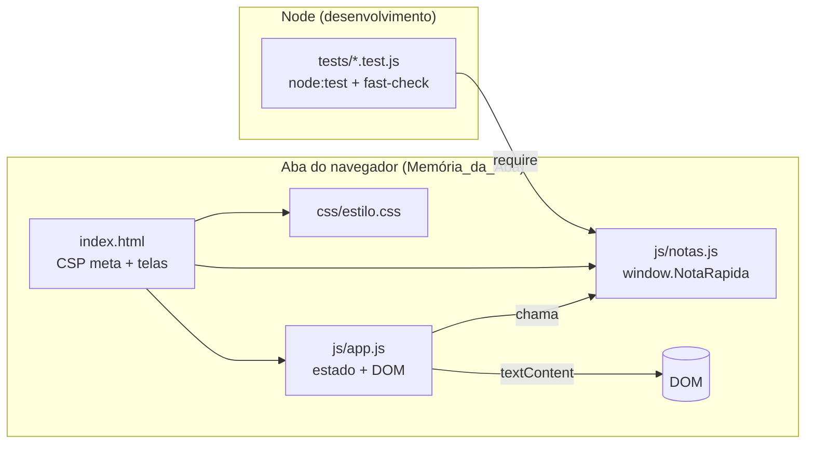
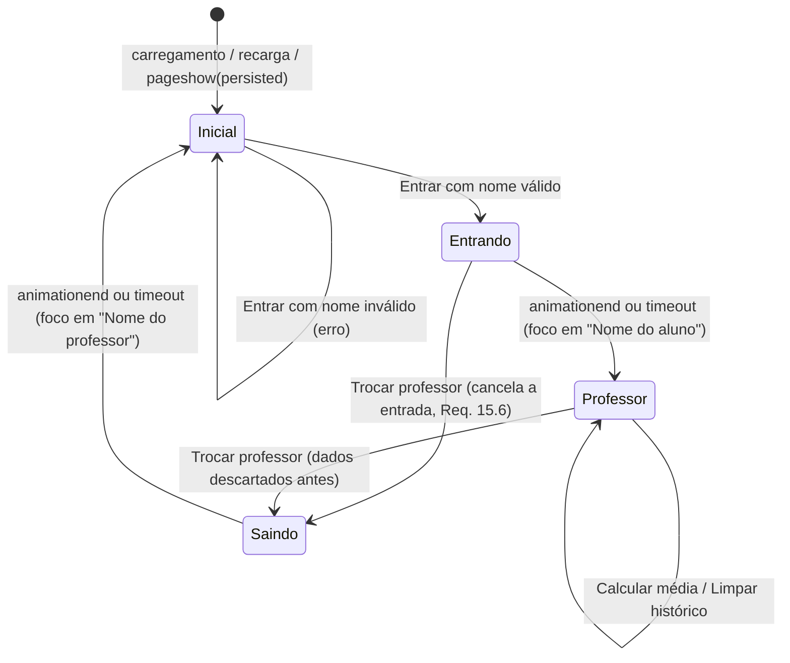
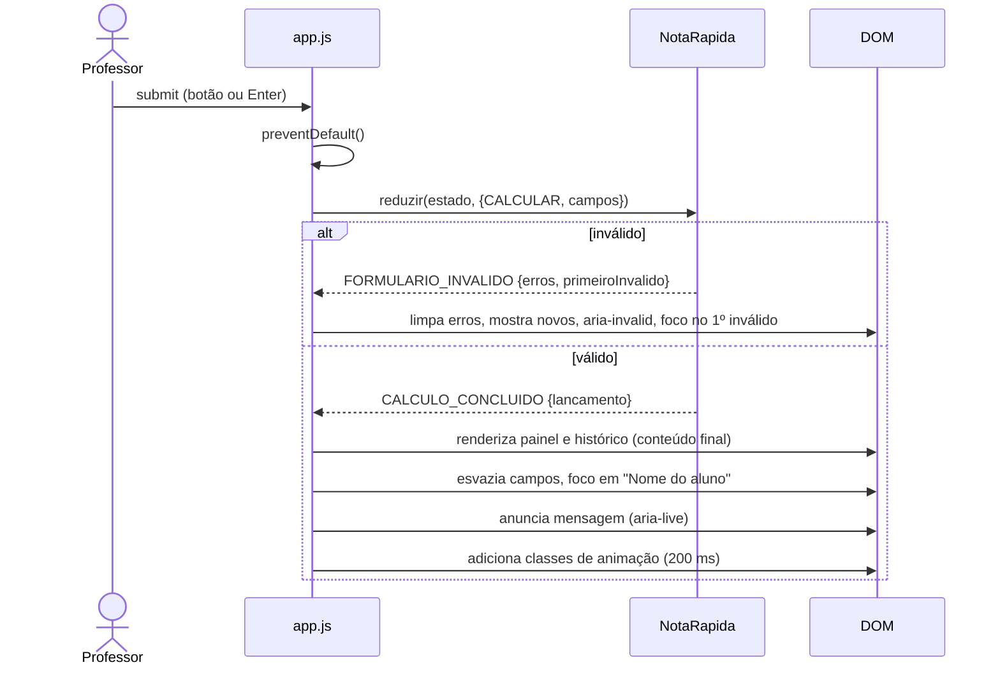

# Design Document

## Overview

O NotaRápida é um site estático de uma página (`site/index.html`) com duas telas: a Tela_Inicial, onde o professor informa o nome, e a Tela_do_Professor, onde ele lança o nome do aluno e as notas T1, T2 e T3 e vê a Média_Final, a Classificação, a Posição_em_Relação_à_Média e os 5 últimos lançamentos.

Tudo roda no navegador com HTML, CSS e JavaScript puro, sem frameworks, sem dependências de runtime, sem servidor e sem armazenamento persistente. O site abre por `file://` (clique duplo) ou por um servidor local simples.

O código tem duas camadas:

- **Lógica pura (`site/js/notas.js`)**: Leitor_de_Nota, Validador, Calculadora_de_Média, Formatador_de_Nota, Histórico_Recente, mensagens e uma função pura de transição da sessão. Não acessa o DOM. Exportada como `window.NotaRapida` no navegador e por `module.exports` no Node, para os testes.
- **Interface (`site/js/app.js`)**: guarda o estado da sessão em variáveis JS (Memória_da_Aba), trata eventos, renderiza com `textContent`, controla foco, anúncios e animações.

### Decisões principais

| Decisão | Escolha | Motivo |
|---|---|---|
| Aritmética | Notas em centésimos inteiros (0 a 1000); soma S (0 a 3000) | Sem erro de ponto flutuante (Req. 6.6, 6.11) |
| Média_Final exata | Fração S/3 em centésimos (`{ numerador: S, denominador: 3 }`) | Média × 3 = soma exatamente (Req. 6.1, 6.11) |
| Classificação | Compara S com 1800, 2400 e 2700 | Usa o valor exato, sem divisão (Req. 6.6) |
| Média exibida | `floor(S / 3)` centésimos, com vírgula e 2 casas (S = 1799 → 599 → "5,99") | Truncamento sem arredondar (Req. 8.5). Como 1800, 2400 e 2700 são múltiplos de 3, a média truncada fica sempre na mesma faixa da exata (Req. 6.13) |
| Scripts | Clássicos, externos, `defer`, sem `import`/`export`, caminhos relativos | Funciona em `file://` (Req. 22.5, 22.7) |
| Telas | Duas `<section>` na mesma página, alternadas com `hidden` + `inert` | Sem mudança de URL nem de histórico (Req. 19.9, 2.7, 2.8) |
| Estado | Variáveis em uma IIFE de `app.js` | Nada em cookies, localStorage, sessionStorage, IndexedDB ou service worker (Req. 19.2) |
| Dados na página | Somente `textContent`, `createElement`, `replaceChildren` | Nenhum dado digitado vira HTML (Req. 20.1) |
| Animações | Classes CSS com `@keyframes` (`opacity` e `transform`), fim por `animationend` + timeout de segurança | Compatível com a CSP (sem estilo inline) e leve (Req. 17.6) |
| Testes | `node:test` + `fast-check` 4.10.2 (devDependency, versão fixa) em `tests/` | Nenhum arquivo de teste é carregado pela página (Req. 16.3, 16.4) |

### Pesquisa que orienta o design

- **CSP `'self'`** libera recursos da mesma origem do documento ([MDN – CSP](https://developer.mozilla.org/en-US/docs/Web/HTTP/Guides/CSP)). Em `file://` a origem não é uma origem HTTP comum, e o resultado depende do navegador. Sem `'unsafe-inline'`, a CSP bloqueia `<script>`/`<style>` inline, atributos `on*` e atributos `style`; mudar classes por JS não é afetado.
- **Firefox e `file://`**: o Firefox trata cada documento `file://` como origem única (preferência `privacy.file_unique_origin`), o que bloqueia módulos ES e `fetch` entre arquivos locais e cria o risco de `'self'` não corresponder aos arquivos vizinhos. Scripts clássicos e folhas de estilo comuns não usam CORS, por isso o design evita módulos e `fetch`.
- **Diretivas em `<meta>`**: `frame-ancestors`, `report-uri`, `report-to` e `sandbox` são ignoradas quando a CSP vem em `<meta>` ([MDN – CSP](https://developer.mozilla.org/en-US/docs/Web/HTTP/Guides/CSP)). Quando houver CSP em cabeçalho e em `<meta>`, vale a combinação mais restritiva.
- **bfcache**: ao voltar pela navegação, o navegador pode restaurar a página da memória; `pageshow` com `event.persisted === true` indica esse caso ([web.dev – bfcache](https://web.dev/articles/bfcache)).
- **fast-check**: a linha atual é a 4.x (a 4.10 prepara a migração para a v5) ([blog do fast-check](https://fast-check.dev/blog/)). A versão exata é fixada no `package.json` e confirmada com `npm view fast-check version` na instalação.

*O conteúdo das fontes foi parafraseado para respeitar restrições de licenciamento.*

## Architecture

### Estrutura de arquivos

```
Projeto-NotaRapida/
├── site/                         ← tudo o que a página carrega (≤ 204.800 bytes, Req. 16.3)
│   ├── index.html                ← CSP em <meta>; as duas telas
│   ├── css/estilo.css            ← Guia_Visual (variáveis), layout, estados, animações
│   ├── js/notas.js               ← lógica pura → window.NotaRapida / module.exports
│   ├── js/app.js                 ← estado em memória, DOM, eventos, foco, transições
│   ├── img/icone.svg             ← favicon (evita 404 de /favicon.ico no servidor local)
│   ├── robots.txt  ai.txt        ← pedidos aos robôs de IA (melhor esforço)
│   └── _headers                  ← cabeçalhos para Netlify/Cloudflare (ignorado no GitHub Pages)
├── tests/                        ← só Node; nunca referenciado pelo index.html
│   ├── leitor-validador.test.js  propriedades.test.js
│   └── injecao.test.js  estatico.test.js
├── .github/workflows/pages.yml   ← testa e publica site/ no GitHub Pages
├── package.json                  ← só para testes ("test": "node --test \"tests/**/*.test.js\"")
└── AulaPython-TRABALHOCONCLUIDO.py
```

Tamanho estimado sem minificação: HTML ≈ 6 KB, CSS ≈ 10 KB, `notas.js` ≈ 8 KB, `app.js` ≈ 12 KB, ícone ≈ 1 KB. Total ≈ 37 KB.

### Camadas



- `notas.js` não usa `window`, `document`, temporizadores nem armazenamento; recebe strings/números e devolve objetos novos, sem mutar argumentos.
- `app.js` é o único que toca o DOM e guarda estado.
- Ordem no `<head>`: `<script src="js/notas.js" defer>` e depois `<script src="js/app.js" defer>`. `defer` preserva a ordem.

### Exportação de `notas.js`

```js
(function (raiz, fabrica) {
  'use strict';
  var api = fabrica();
  if (typeof module === 'object' && module && module.exports) {
    module.exports = api;            // Node (testes)
  } else {
    raiz.NotaRapida = api;           // navegador
  }
})(typeof globalThis !== 'undefined' ? globalThis : this, function () {
  'use strict';
  // implementação
  return Object.freeze({ /* API em Components and Interfaces */ });
});
```

### Telas e transições



Acionamentos repetidos de "Entrar" ou "Trocar professor" durante a transição do mesmo botão são ignorados (`transicao.emCurso` + `inert` na tela que sai, Req. 15.4).

### Fluxo de "Calcular média"



O conteúdo final é escrito antes da animação (Req. 17.4). As animações só mexem em `opacity` e `transform`; interromper uma animação deixa a tela no estado final (Req. 10.12, 17.5).

### Política de Segurança de Conteúdo

`<meta http-equiv="Content-Security-Policy">` logo após `<meta charset="utf-8">`, antes de qualquer `<link>` ou `<script>` (Req. 20.9):

```
default-src 'none'; script-src 'self'; style-src 'self'; img-src 'self';
font-src 'none'; connect-src 'none'; object-src 'none'; frame-src 'none';
worker-src 'none'; manifest-src 'none'; base-uri 'none'; form-action 'none';
require-trusted-types-for 'script'; trusted-types 'none'
```

| Diretiva | Efeito | Req. |
|---|---|---|
| `default-src 'none'` | Bloqueia tudo que não for liberado | 20.2 |
| `script-src 'self'` | Só `notas.js` e `app.js`; bloqueia inline, `on*` e `eval`/`new Function` | 20.2, 20.3 |
| `style-src 'self'` | Só `estilo.css`; bloqueia `<style>` e `style="..."` | 20.2 |
| `img-src 'self'` | Só `icone.svg` | 20.2 |
| `font-src 'none'` | Nenhum arquivo de fonte (só fontes do sistema) | 10.2 |
| `connect-src 'none'` | Bloqueia `fetch`, XHR, WebSocket, `sendBeacon` | 14.6, 19.3 |
| `object-src`, `frame-src`, `worker-src 'none'` | Sem plugins, quadros, workers ou service workers | 19.2, 20.2 |
| `base-uri 'none'`, `form-action 'none'` | Sem `<base>`; nenhum formulário é enviado | 19.9, 20.2 |
| `require-trusted-types-for 'script'`, `trusted-types 'none'` | Trusted Types: nos navegadores que suportam, qualquer atribuição de string a `innerHTML`, `eval` e afins é bloqueada, e nenhuma política pode ser criada | 20.1, 20.2 |

**Risco de `'self'` em `file://`.** No servidor local, `'self'` corresponde a `http://localhost:porta` e libera os arquivos do site. Em `file://`, o Chrome e o Edge costumam aceitar arquivos da mesma pasta, mas no Firefox (origem única por arquivo) e no Safari o comportamento precisa ser confirmado. Se `'self'` não corresponder, a página aparece sem estilo e sem JS, com violações de CSP no console.

**Verificação manual obrigatória** (antes de concluir a implementação): abrir `site/index.html` por clique duplo no Firefox, Chrome, Edge e Safari; abrir o console e recarregar; confirmar ausência de mensagens de CSP e de erros de carregamento; confirmar que a Tela_Inicial aparece com o Guia_Visual e que "Entrar" funciona. Repetir pelo servidor local (ex.: `python -m http.server 8080 --directory site`).

**Contingência**: se algum navegador bloquear em `file://`, acrescentar `file:` a `script-src`, `style-src` e `img-src`. No modo HTTP isso não libera nada (páginas `http:` não carregam `file:`); em `file://` amplia a origem permitida, risco aceitável porque nenhum dado é inserido como HTML. As demais restrições continuam. A decisão fica registrada em comentário no topo do `index.html` e neste documento.

### Hospedagem no GitHub Pages (dentro do escopo)

A hospedagem deixou de estar fora do escopo: o site é publicado no GitHub Pages (Req. 20.7, 20.8, 22).

- Repositório: https://github.com/AlanSouzaDev7/Projet.Site_NotaRapida
- URL pública: https://alansouzadev7.github.io/Projet.Site_NotaRapida/ (HTTPS com o certificado do `github.io`)
- `.github/workflows/pages.yml`: a cada push em `main` (ou manualmente), o job `testar` roda `npm ci` e `npm test` no Node 24; só se passar, o job `publicar` envia **somente a pasta `site/`** com `upload-pages-artifact` + `deploy-pages`. Permissões mínimas (`contents: read`, `pages: write`, `id-token: write`) e `persist-credentials: false`.

**Anti-quadro por script.** O GitHub Pages não aceita cabeçalhos personalizados, e `frame-ancestors` é ignorado em `<meta>`. Por isso `app.js` testa, no início, se a página está dentro de um quadro (`window.top !== window.self`, erro de acesso conta como quadro); se estiver, adiciona `html.em-quadro`, o CSS esconde `.palco`, o aviso `#aviso-quadro` aparece e o NotaRápida não é iniciado. É uma proteção de melhor esforço contra clickjacking (não funciona com JS desativado).

**`site/_headers`.** Contém a CSP com `frame-ancestors 'none'`, HSTS, `X-Content-Type-Options: nosniff`, `Referrer-Policy`, `X-Frame-Options: DENY`, `X-Robots-Tag` e afins. Vale só em Netlify ou Cloudflare Pages; no GitHub Pages é ignorado e valem apenas a CSP em `<meta>` e o anti-quadro do script.

**Robôs de IA (melhor esforço).** `site/robots.txt`, `site/ai.txt` e `<meta name="robots" content="noai, noimageai">` pedem que robôs de IA não coletem o site. São só pedidos: robôs podem ignorá-los, e o `robots.txt` só é lido na raiz do domínio, então em `alansouzadev7.github.io/Projet.Site_NotaRapida/` ele não é consultado (vale com domínio próprio). Nenhum dado de professor ou aluno sai da aba, então não há dado do usuário a proteger por esse meio.

## Components and Interfaces

### 1. `site/index.html`

Estrutura resumida (ids usados por `app.js`):

```html
<!doctype html>
<html lang="pt-BR">
<head>
  <meta charset="utf-8">
  <meta http-equiv="Content-Security-Policy" content="default-src 'none'; script-src 'self'; ...">
  <meta name="viewport" content="width=device-width, initial-scale=1">
  <meta name="referrer" content="no-referrer">
  <title>NotaRápida – Entrar</title>
  <link rel="icon" href="img/icone.svg" type="image/svg+xml">
  <link rel="stylesheet" href="css/estilo.css">
  <script src="js/notas.js" defer></script>
  <script src="js/app.js" defer></script>
</head>
<body>
  <noscript><p class="aviso-noscript">Ative o JavaScript para usar o NotaRápida.</p></noscript>
  <div class="palco">
    <section id="tela-inicial" class="tela tela--inicial" aria-labelledby="titulo-app">
      <div class="cartao cartao--entrada">
        <h1 id="titulo-app" class="marca">NotaRápida</h1>
        <form id="form-entrada" novalidate>
          <label for="campo-professor">Nome do professor</label>
          <input id="campo-professor" type="text" maxlength="1000"
                 autocomplete="off" spellcheck="false" autocorrect="off" autocapitalize="words">
          <p id="erro-professor" class="campo__erro" hidden></p>
          <button type="submit" class="botao botao--primario">Entrar</button>
        </form>
        <p class="nota-privacidade">O seu nome é usado apenas para personalizar a tela e não é salvo.</p>
      </div>
    </section>

    <section id="tela-professor" class="tela tela--professor" aria-labelledby="saudacao" hidden inert>
      <header class="cabecalho"><h1 id="saudacao"></h1></header>
      <p class="aviso-dados">Os dados não são salvos. O nome do professor, os nomes dos alunos e as notas
        ficam apenas nesta aba e são apagados ao trocar de professor, recarregar ou fechar a página.
        Apenas os 5 últimos lançamentos aparecem.</p>
      <div class="grade">
        <section class="cartao painel-form" aria-labelledby="titulo-form">
          <h2 id="titulo-form">Lançar notas</h2>
          <form id="form-notas" novalidate>
            <!-- campo-aluno/erro-aluno; campo-t1..t3/erro-t1..t3 com inputmode="decimal"
                 e placeholder="ex.: 7,5"; todos com maxlength="1000", autocomplete="off",
                 spellcheck="false" -->
            <button type="submit" class="botao botao--primario">Calcular média</button>
          </form>
        </section>
        <section class="cartao painel-resultado" aria-labelledby="titulo-resultado">
          <h2 id="titulo-resultado">Resultado</h2>
          <p id="resultado-vazio">Nenhum resultado calculado ainda.</p>
          <div id="resultado-conteudo" hidden>
            <!-- res-aluno, res-selo, res-posicao, res-media, res-notas (dl T1/T2/T3),
                 res-classificacao, res-mensagem -->
          </div>
        </section>
        <section class="cartao painel-historico" aria-labelledby="titulo-historico">
          <h2 id="titulo-historico">Últimos lançamentos</h2>
          <button type="button" id="botao-limpar" class="botao botao--secundario">Limpar histórico</button>
          <p id="historico-vazio">Nenhuma nota lançada ainda.</p>
          <ol id="historico-lista" hidden></ol>
        </section>
      </div>
      <div class="acoes">
        <button type="button" id="botao-trocar" class="botao botao--secundario">Trocar professor</button>
      </div>
      <p id="anuncio" class="visualmente-oculto" aria-live="polite" aria-atomic="true"></p>
    </section>
  </div>
</body>
</html>
```

Notas:

- Sem `<style>`, sem atributos `style` e sem `on*` (Req. 20.2). A Tela_do_Professor começa com `hidden inert`, e o CSS no `<head>` bloqueia a renderização, então nada aparece sem estilo (Req. 16.5).
- Notas com `type="text"` + `inputmode="decimal"`: teclado numérico no celular e aceitação de qualquer caractere (Req. 4.8). `type="number"` rejeitaria a vírgula em alguns navegadores.
- `maxlength="1000"` descarta o excedente ao digitar ou colar, sem mensagem (Req. 1.12, 20.4). `autocomplete="off"` desativa sugestões (Req. 19.8).
- O botão "Trocar professor" é o último focável no DOM e o grid o posiciona no cabeçalho, à direita da saudação. Assim a ordem de foco do Req. 21.9 é mantida e o botão fica visível no topo.
- `#anuncio` é a única região `aria-live`; o painel não é região viva, para o resultado ser lido uma vez (Req. 7.9).
- Viewport sem `maximum-scale` nem `user-scalable=no` (Req. 21.14).

### 2. Guia_Visual (`site/css/estilo.css`, variáveis em `:root`)

#### Paleta

Contrastes pela fórmula das WCAG 2.1 (valores aproximados).

| Token | Hex | Uso | Contraste |
|---|---|---|---|
| `--cor-fundo` | `#F4F6FA` | Fundo da página | – |
| `--cor-superficie` | `#FFFFFF` | Cartões e campos | – |
| `--cor-superficie-suave` | `#EEF2F7` | Faixa do aviso de dados | – |
| `--cor-texto` | `#1A2233` | Texto principal | ≈ 15,9:1 no branco; ≈ 14,7:1 no fundo |
| `--cor-texto-suave` | `#4A5568` | Textos de apoio e avisos | ≈ 7,5:1 no branco; ≈ 6,7:1 na faixa |
| `--cor-placeholder` | `#5B6472` | "ex.: 7,5" | ≈ 6,0:1 no branco |
| `--cor-primaria` | `#1D4ED8` | Botão primário (azul institucional), botão secundário, anel de foco | ≈ 6,7:1 com branco |
| `--cor-destaque` | `#1E3A8A` | Botão primário sob o ponteiro | ≈ 10,4:1 com branco |
| `--cor-destaque-suave` | `#EFF4FF` | Fundo do secundário sob o ponteiro | texto `#1E3A8A` ≈ 9,4:1 |
| `--cor-borda-campo` | `#6B7280` | Borda padrão dos campos | ≈ 4,8:1 no branco (mín. 3:1) |
| `--cor-erro` | `#B91C1C` | Borda e texto de erro | ≈ 6,5:1 no branco |
| `--cor-reprovado` | `#B91C1C` | Fundo do rótulo "Reprovado" (texto branco) | ≈ 6,5:1 |
| `--cor-aprovado` | `#15803D` | Fundo do rótulo "Aprovado" (texto branco), igual nas 3 aprovações | ≈ 5,0:1 |

#### Tipografia

- `--fonte: system-ui, "Segoe UI", Roboto, Arial, sans-serif;` (só fontes do sistema, sem `@font-face`, termina em família genérica, Req. 10.2).
- Escala: 14px (avisos, erros, rótulos de situação), 16px (texto, botões e **todos os campos**, Req. 21.13), 20px (h2), 28px (saudação; 24px abaixo de 640px), 32px (marca), 40px (valor da média).
- Pesos 400/600/700; altura de linha 1,5 (texto) e 1,25 (títulos); `font-variant-numeric: tabular-nums` nas notas.
- Saudação e nomes com `overflow-wrap: anywhere`, para 100 caracteres sem espaço quebrarem linha sem truncar (Req. 2.1, 9.4, 21.1).

#### Espaçamento, raios e sombras

- Espaçamento: `--esp-1: 4px`, `--esp-2: 8px`, `--esp-3: 12px`, `--esp-4: 16px`, `--esp-5: 24px`, `--esp-6: 32px`, `--esp-7: 48px`.
- Raios: `--raio-p: 8px` (campos, botões), `--raio-g: 12px` (cartões), `--raio-pilula: 999px` (rótulos).
- Sombras: `--sombra-cartao: 0 1px 2px rgba(16,24,40,.06), 0 4px 12px rgba(16,24,40,.08)`; `--sombra-entrada: 0 8px 24px rgba(16,24,40,.10)`.
- Campos e botões com `min-height: 44px`; botões com `min-width: 44px` (Req. 21.10). Bordas de 2px que não mudam de espessura no erro.

#### Estados

| Elemento | Normal | Ponteiro sobre | Foco | Erro |
|---|---|---|---|---|
| Campo | Borda 2px `--cor-borda-campo` | – | `outline: 3px solid var(--cor-primaria); outline-offset: 2px` em `:focus` | Borda `--cor-erro`, `aria-invalid="true"`, mensagem abaixo |
| Botão primário | Fundo `--cor-primaria`, texto branco | Fundo `--cor-destaque` | Mesmo anel, em `:focus-visible` | – |
| Botão secundário | Fundo branco, texto e borda `--cor-primaria` | Fundo `--cor-destaque-suave`, texto/borda `--cor-destaque` | Mesmo anel | – |

O anel tem 3px e ≈ 6,7:1 com o branco (Req. 21.7). Campos usam `:focus` para o anel aparecer também no foco posto pelo script. Nenhum cartão usa `overflow: hidden`, para o anel não ser cortado.

#### Layout

- Tela_Inicial: `.tela--inicial { min-height: 100vh; display: grid; place-items: center; padding: var(--esp-5) var(--esp-4); }` e `.cartao--entrada { width: min(100%, 440px); }` (centralização simétrica, Req. 10.3).
- `.palco { display: grid; }` com `.palco > .tela { grid-area: 1 / 1; }`: as duas telas ocupam a mesma célula durante a transição.
- Tela_do_Professor: container `max-width: 1200px; margin-inline: auto`; áreas `"cabecalho acoes" "aviso aviso" "grade grade"`; abaixo de 640px, `"cabecalho" "acoes" "aviso" "grade"`.
- `.grade`: a partir de 1024px, `grid-template-columns: minmax(0,1fr) minmax(0,1fr)` com áreas `"form resultado" "historico historico"` (Req. 10.4); abaixo, uma coluna na ordem formulário, resultado, histórico (Req. 10.5).
- T1, T2 e T3 em 3 colunas a partir de 480px; empilhadas abaixo disso.

Esboço – Tela_Inicial:

```
┌──────────────────────────────────────────────────────┐
│                    fundo #F4F6FA                     │
│        ┌──────────────────────────────────┐          │
│        │  NotaRápida                      │          │
│        │  Nome do professor               │          │
│        │  [______________________________]│ ← foco   │
│        │  Informe o nome do professor.    │ (erro)   │
│        │  [            Entrar            ]│          │
│        │  O seu nome é usado apenas para  │          │
│        │  personalizar a tela e não é     │          │
│        │  salvo.                          │          │
│        └──────────────────────────────────┘          │
│          cartão branco centralizado, até 440px       │
└──────────────────────────────────────────────────────┘
```

Esboço – Tela_do_Professor, largura ≥ 1024px:

```
┌──────────────────────────────────────────────────────────────────────┐
│ Olá, Prof. Ana Souza                              [Trocar professor] │
│ ┃ Os dados não são salvos. ... Apenas os 5 últimos lançamentos       │
│ ┃ aparecem.                                                          │
│ ┌── Lançar notas ───────────────┐  ┌── Resultado ──────────────────┐ │
│ │ Nome do aluno                 │  │ Maria Oliveira                │ │
│ │ [___________________________] │  │ (Aprovado) (Na média)         │ │
│ │ T1        T2        T3        │  │ Média final  7,16             │ │
│ │ [_____]   [_____]   [_____]   │  │ T1 7,50 · T2 6,00 · T3 8,00   │ │
│ │ [      Calcular média       ] │  │ Classificação: Aprovado – na  │ │
│ └───────────────────────────────┘  │ média                         │ │
│                                    │ Parabéns Maria Oliveira, você │ │
│                                    │ foi aprovado com a média final│ │
│                                    │ de 7,16. Você está na média.  │ │
│                                    └───────────────────────────────┘ │
│ ┌── Últimos lançamentos ─────────────────────── [Limpar histórico] ┐ │
│ │ 1 Maria Oliveira  T1 7,50 T2 6,00 T3 8,00  Média 7,16            │ │
│ │   (Aprovado – na média)  Na média                                │ │
│ │ 2 ...                                    (até 5, mais recente 1º)│ │
│ └──────────────────────────────────────────────────────────────────┘ │
└──────────────────────────────────────────────────────────────────────┘
```

Abaixo de 1024px a mesma ordem vira uma coluna: saudação, "Trocar professor" (abaixo da saudação em < 640px), aviso, Lançar notas, Resultado, Últimos lançamentos.

#### Resultado e histórico

- Rótulo de situação (`.selo`): pílula, 14px, peso 600, texto branco; `.selo--aprovado` (`--cor-aprovado`) para as três aprovações e `.selo--reprovado` (`--cor-reprovado`) (Req. 7.6). As mesmas classes colorem a Classificação no histórico (Req. 10.13).
- Indicador de posição (`.indicador`): pílula branca, borda 2px `--cor-borda-campo`, texto `--cor-texto` ("Abaixo da média", "Na média" ou "Acima da média"), identificável pelo texto (Req. 7.7).
- Histórico em `<ol>`; cada `<li class="lancamento">` mostra nome completo, T1, T2, T3, média formatada, Classificação e Posição (Req. 9.4).

#### Animações

| Animação | Duração | Keyframes | Req. |
|---|---|---|---|
| Transição_de_Tela – sai | 300 ms, `cubic-bezier(.2,0,.2,1)` | `opacity 1→0`, `translateY(0→-8px)` | 17.1 |
| Transição_de_Tela – entra | 300 ms (simultânea) | `opacity 0→1`, `translateY(12px→0)` | 17.1 |
| Animação_de_Resultado | 200 ms, `ease-out` | `#resultado-conteudo`: `opacity 0→1`, `translateY(6px→0)` | 17.2 |
| Animação_de_Histórico | 200 ms, `ease-out` | Item novo: `opacity 0→1`, `translateY(-6px→0)`; ao limpar, `#historico-vazio`: `opacity 0→1` | 17.7 |

Classes: `.tela--saindo`, `.tela--entrando`, `.anim-resultado`, `.anim-historico`. Durações em variáveis (`--dur-tela: 300ms`, `--dur-curta: 200ms`).

```css
@media (prefers-reduced-motion: reduce) {
  :root { --dur-tela: 0.01s; --dur-curta: 0.01s; }
  .botao { transition: none; }
}
```

Com Movimento_Reduzido, a duração cai para 10 ms (≤ 0,01 s, Req. 10.11) e `animationend` continua disparando, então a mesma lógica de finalização vale nos dois modos (Req. 10.12).

Regras do controlador de animação (`app.js`):

- `animar(el, classe, aoTerminar)`: remove a classe, força reflow (`void el.offsetWidth`), adiciona a classe, espera `animationend` com `e.target === el` e arma um timeout de segurança (`duração + 100 ms`). A finalização é idempotente (roda uma vez, seja pelo evento ou pelo timeout).
- Nova animação do mesmo tipo reinicia a classe e cancela o timeout anterior (Req. 17.5).
- Inserção com remoção do mais antigo: o item removido sai do DOM antes da animação, e só o novo item anima, em um único ciclo de 200 ms (Req. 17.7).
- Animações nunca mudam o foco (Req. 17.8).

### 3. `site/js/notas.js` – API (`window.NotaRapida`)

```js
NotaRapida = {
  constantes: { LIMITE_NOME: 100, TAMANHO_HISTORICO: 5,
                LIMITES_SOMA: { NA_MEDIA: 1800, ACIMA: 2400, EXCELENTE: 2700 } },
  CLASSIFICACOES: ['Reprovado', 'Aprovado – na média', 'Aprovado – acima da média', 'Aprovado – excelente'],
  POSICOES: ['Abaixo da média', 'Na média', 'Acima da média'],
  mensagens: {
    PROFESSOR_VAZIO: 'Informe o nome do professor.',
    ALUNO_VAZIO: 'Informe o nome do aluno.',
    NOME_LONGO: 'O nome deve ter no máximo 100 caracteres.',
    NOTA_VAZIA: 'Informe a nota.',
    NOTA_INVALIDA: 'Digite um número válido (ex.: 7,5).',
    NOTA_FORA: 'A nota deve estar entre 0 e 10.',
    NOTA_CASAS: 'Use no máximo 2 casas decimais.'
  },
  aparar(texto),                 // trim()
  contarCaracteres(texto),       // pontos de código após normalize('NFC')
  lerNota(texto),                // Leitor_de_Nota → ResultadoLeitura
  formatarCentesimos(c),         // 750 → "7,50"; 1000 → "10,00"; 50 → "0,50"
  formatarMedia(soma),           // formatarCentesimos(Math.floor(soma / 3)); 1799 → "5,99"
  validarNomeProfessor(texto),   // { ok: true, nome } | { ok: false, erro }
  validarNomeAluno(texto),       // idem
  validarNota(texto),            // { ok: true, centesimos } | { ok: false, erro }
  validarFormulario(campos),     // { nomeAluno, t1, t2, t3 } → ok + dados | erros + primeiroInvalido
  calcular([c1, c2, c3]),        // → ResultadoCalculo
  classificarSoma(soma),         // → uma das 4 Classificações
  posicionarSoma(soma),          // → uma das 3 Posições
  rotuloSituacao(classificacao), // → 'Reprovado' | 'Aprovado'
  montarMensagem(nome, classificacao, mediaTexto),
  adicionarAoHistorico(lista, lancamento),   // [lancamento, ...lista].slice(0, 5)
  estadoInicial(),
  reduzir(estado, acao)          // → { estado, evento }
}
```

Mensagens de resultado (`montarMensagem`), com o nome inserido como string comum e exibido por `textContent`:

| Classificação | Texto |
|---|---|
| Reprovado | `Infelizmente {nome}, você foi reprovado com a média final de {média}.` |
| Aprovado – na média | `Parabéns {nome}, você foi aprovado com a média final de {média}. Você está na média.` |
| Aprovado – acima da média | `Parabéns {nome}, você foi aprovado com a média final de {média}. Você está acima da média.` |
| Aprovado – excelente | `Parabéns {nome}, você foi aprovado com a média final de {média}. Você é um gênio!` |

Saudação: `'Olá, Prof. ' + nomeProfessor`.

#### Leitor_de_Nota

1. `t = aparar(texto)`; se `t === ''` → `{ tipo: 'vazio' }` (Req. 8.9).
2. Testar `/^(-?)([0-9]+)(?:[.,]([0-9]+))?$/` (Req. 8.7). Sem correspondência → `{ tipo: 'erro' }` (Req. 8.4): `"abc"`, `"7,5,0"`, `"7,"`, `",5"`, `"7 5"`, `"+7"`, `"1e1"`, `"1.000,5"`.
3. Com correspondência → `{ tipo: 'numero', negativo, inteiro, fracao }`, mesmo fora de 0 a 10 ou com mais de 2 casas (Req. 8.8). `inteiro` sem zeros à esquerda (`'0'` se só zeros); `fracao` como digitada.

#### `validarNota` (ordem do Req. 5.10)

1. `vazio` → `NOTA_VAZIA`. 2. `erro` → `NOTA_INVALIDA`.
3. Intervalo decidido nas strings (sem ponto flutuante, aceita até 1.000 dígitos): `zero = inteiro === '0' && !/[1-9]/.test(fracao)`; `fora = (negativo && !zero) || inteiro.length > 2 || Number(inteiro) > 10 || (inteiro === '10' && /[1-9]/.test(fracao))` → `NOTA_FORA`. Assim `"10,00"` e `"-0"` passam; `"10,01"` e `"-0,5"` não.
4. `fracao.length > 2` → `NOTA_CASAS` (`"7,500"` rejeitado, Req. 5.6).
5. Sucesso: `centesimos = Number(inteiro) * 100 + Number((fracao + '00').slice(0, 2))`.

#### Nomes

`nome = aparar(texto)`; `n = contarCaracteres(nome)`; `n === 0` → mensagem de vazio; `n > 100` → `NOME_LONGO`; senão `{ ok: true, nome }` com espaços internos e caracteres preservados (Req. 1.7, 1.11, 5.9). `trim()` cobre espaço, tabulação e quebra de linha.

#### `validarFormulario`

Avalia sempre os quatro campos (Req. 4.3); `erros` só com os inválidos; `primeiroInvalido` na ordem `nomeAluno`, `t1`, `t2`, `t3` (Req. 5.8).

#### `calcular`

```js
soma = c1 + c2 + c3                                  // inteiro 0..3000
media = { numerador: soma, denominador: 3 }          // centésimos, fração exata
mediaTruncada = Math.floor(soma / 3)                 // centésimos exibidos
classificacao = soma < 1800 ? 'Reprovado' : soma < 2400 ? 'Aprovado – na média'
              : soma < 2700 ? 'Aprovado – acima da média' : 'Aprovado – excelente'
posicao = soma < 1800 ? 'Abaixo da média' : soma < 2400 ? 'Na média' : 'Acima da média'
```

### 4. `site/js/app.js` – interface

IIFE com `'use strict'`, sem globais próprias.

| Parte | Responsabilidade |
|---|---|
| `refs` | Elementos obtidos uma vez por `getElementById` |
| `estado` | `EstadoSessao` atual (único estado de dados) |
| `transicao` | `{ emCurso, destino, timeout }` |
| Renderização | `renderSaudacao`, `renderErros`, `limparErros`, `renderResultado`, `renderHistorico`, `anunciar`, `limparFormulario` – só `textContent`/`createElement`/`replaceChildren` |
| Controladores | `aoEnviarEntrada`, `aoEnviarNotas`, `aoLimparHistorico`, `aoTrocarProfessor` |
| Ciclo de vida | `iniciar`, `pagehide`, `pageshow` |

- **Entrar**: `preventDefault()`; se `transicao.emCurso`, ignora. `reduzir(ENTRAR)`. Inválido: remove o erro anterior e mostra o novo, `aria-invalid="true"`, `aria-describedby="erro-professor"`, texto mantido, foco no campo (Req. 1.6, 1.9, 1.10). Válido: saudação via `textContent`, `trocarTela('professor')`.
- **`trocarTela(destino)`**: `emCurso = true`; `inert` na tela que sai já no início (Req. 21.12); tira `hidden`/`inert` da que entra (digitação aceita durante a transição, Req. 17.3); `document.title` = "NotaRápida – Lançamento de notas" ou "NotaRápida – Entrar" (Req. 21.11); `scrollTo(0, 0)`; aplica `.tela--saindo`/`.tela--entrando`. Ao finalizar: `hidden` na tela que saiu, remove classes, foco em `#campo-aluno` ou `#campo-professor` (Req. 1.2, 2.5, 3.2), `emCurso = false`. Ao finalizar a entrada, esvazia o campo do professor.
- **Calcular**: `preventDefault()`; `reduzir(CALCULAR, campos)`. `FORMULARIO_INVALIDO`: limpa erros, mostra todos, foco no primeiro inválido; sem anúncio e sem animação (Req. 5.7, 7.10, 10.15). `CALCULO_CONCLUIDO`: renderiza painel e histórico, esvazia os campos e erros, foco em `#campo-aluno`, `anunciar(mensagem)`, animações (Req. 4.6, 7.9). Enter em qualquer campo dispara o mesmo `submit` (Req. 4.5).
- **`anunciar(texto)`**: esvazia `#anuncio` e escreve no próximo `requestAnimationFrame`, para que uma mensagem igual à anterior também seja lida (Req. 7.9).
- **Limpar histórico**: se havia itens, mostra "Nenhuma nota lançada ainda." e anima; se não, nada muda (Req. 9.7, 9.9, 10.15).
- **Trocar professor**: se `emCurso` com destino `inicial`, ignora (Req. 15.4); se destino `professor`, cancela a entrada (Req. 15.6). Antes da transição: cancela animações em curso, `estado = reduzir(TROCAR_PROFESSOR).estado`, esvazia saudação, painel, histórico, `#anuncio`, os cinco campos e erros (Req. 3.1, 3.6, 3.7); depois `trocarTela('inicial')`.
- **Ciclo de vida**: `iniciar()` esvazia os cinco campos (restauração por duplicar/reabrir aba, Req. 18.9, 19.5), garante a Tela_Inicial e foca "Nome do professor". `pagehide` descarta os dados e volta o DOM à Tela_Inicial sem animação. `pageshow` com `event.persisted` repete a limpeza e foca o campo (Req. 19.6). Sem `history.pushState`, sem `location.hash` (Req. 19.9).
- **Console**: nenhuma chamada a `console.*` (Req. 20.5).

### 5. Tratamento, média de aprovação e resultado parcial

#### Tratamento e temas

- Tela_Inicial: grupo de rádios `name="tratamento"` (`feminino`, `masculino`, `neutro`), com `neutro` ("Prefiro não informar") marcado no carregamento, no `pageshow` e após "Trocar professor" (Req. 11.1, 11.2).
- `normalizarTratamento(v)`: qualquer valor fora dos três vira `'neutro'` (Req. 11.3, 11.4). `estado.tratamento` guarda o valor só na Memória_da_Aba.
- `montarSaudacao(nome, tratamento)` → `'Olá, Prof.ª ' + nome` para `feminino` e `'Olá, Prof. ' + nome` nos demais casos (Req. 11.5, 11.6). Substitui a saudação fixa da seção 3.
- `aplicarTema(tratamento)` põe uma única classe no `<body>`: `tema--feminino` (primária `#A3366F`, realce rosa→lilás no cabeçalho), `tema--masculino` (`#1E3A5F`, realce cinza-azulado) ou `tema--neutro` (`#1D4ED8`, sem realce) (Req. 11.7). Cada tema só redefine as variáveis de cor primária/destaque; aprovado, reprovado, "Em andamento" e erro não mudam (Req. 11.9).
- `.tela--inicial` redefine as mesmas variáveis com os valores neutros, então a Tela_Inicial é sempre neutra, inclusive na transição de saída (Req. 11.8). Ao encerrar a sessão, `aplicarTema('neutro')` (Req. 11.10).

#### Média de aprovação

- Campo "Média para aprovação" (primeiro do formulário, valor inicial "6,00") com ajuda `aria-describedby` "Acima da média a partir de {A} · Excelente a partir de {E}", atualizada no `input` só com valores válidos (Req. 12.1–12.4).
- `validarMediaAprovacao(texto)`: mesma leitura de `lerNota`, ordem vazio → conversão → intervalo 1–10 → casas, com as mensagens do Req. 12.5; sucesso → `{ ok: true, centesimos: M }`.
- `limitesDaMedia(M)` → `{ aprovacao: M, acima: A, excelente: E }`, com `A = floor((M + 1000) / 2)` e `E = floor((M + 3000) / 4)` (Req. 12.6). M = 600 → A = 800, E = 900 (Req. 12.9).
- `classificarSoma(S, M)` e `posicionarSoma(S, M)` comparam S com `3M`, `3A` e `3E`, só com inteiros (Req. 12.7). `calcular(notas, M)` passa a devolver também `mediaAprovacao` e `limites`; com M omitido, vale 600. O Lançamento guarda M, exibido como "Média para aprovação: {M}" (Req. 12.10).

#### Resultado parcial

- `validarNotaOpcional(texto)`: campo vazio → `{ ok: true, centesimos: null, faltante: true }`; senão, `validarNota`. Com os três vazios, `validarFormulario` põe "Informe ao menos uma nota." em T1 (Req. 13.2, 13.3).
- `calcularParcial(notas, M)` (k = 1 ou 2 faltantes): `somaConhecida` Sk, média parcial `p = floor(Sk / (3 − k))`, rótulos faltantes e as duas Metas; com k fora de 1–2 devolve `null` (Req. 13.4, 13.5).
- `metaParaAlvo(X, Sk, k)`: `R = 3X − Sk`; `R ≤ 0` → `garantida`; `n = ceil(R / k)` calculado com inteiros (`floor((R + k − 1) / k)`); `n > 1000` → `impossivel`; senão `{ status: 'possivel', centesimos: n }`. Chamada com X = M (aprovação) e X = A (acima da média) (Req. 13.4, 13.6, 13.7).
- Painel e histórico mostram o selo "Em andamento" (`#475569`, igual nos três temas), sem Classificação nem Posição; cada nota faltante aparece como "—" com `aria-hidden="true"` mais um texto visualmente oculto "sem nota" (Req. 13.5, 13.8).

## Data Models

### Representação numérica

| Conceito | Representação | Faixa | Exemplo |
|---|---|---|---|
| Nota_Trimestral | inteiro em centésimos | 0–1000 | "7,5" → 750 |
| Soma S | inteiro | 0–3000 | 599 + 600 + 600 = 1799 |
| Média_Final exata | fração `S/3` centésimos | 0–1000 | 1799/3 = 599,666… |
| Média exibida | `floor(S/3)` centésimos | 0–1000 | 599 → "5,99" |

### ResultadoLeitura

```js
{ tipo: 'vazio' } | { tipo: 'erro' }
| { tipo: 'numero', negativo: boolean, inteiro: string, fracao: string }
```

### ResultadoCalculo

```js
{ soma, media: { numerador: soma, denominador: 3 }, mediaTruncada,
  classificacao, posicao }
```

| S | Média exata | Classificação | Posição | Rótulo |
|---|---|---|---|---|
| 0–1799 | 0 ≤ m < 6 | Reprovado | Abaixo da média | Reprovado |
| 1800–2399 | 6 ≤ m < 8 | Aprovado – na média | Na média | Aprovado |
| 2400–2699 | 8 ≤ m < 9 | Aprovado – acima da média | Acima da média | Aprovado |
| 2700–3000 | 9 ≤ m ≤ 10 | Aprovado – excelente | Acima da média | Aprovado |

### Lançamento

```js
{ id, nomeAluno, notas: [c1, c2, c3], soma, mediaTruncada, classificacao, posicao }
```

`id` é sequencial na sessão. Os textos exibidos (notas, média, rótulo, mensagem) são derivados na renderização pelas funções de `notas.js`, então painel e histórico mostram o mesmo texto para o mesmo Lançamento.

### EstadoSessao

```js
{ tela: 'inicial' | 'professor', nomeProfessor: string | null,
  resultado: Lancamento | null, historico: Lancamento[] /* 0..5, mais recente primeiro */,
  proximoId: number }
```

`estadoInicial()` → `{ tela: 'inicial', nomeProfessor: null, resultado: null, historico: [], proximoId: 0 }`. Os textos digitados ficam só nos `<input>` (também Memória_da_Aba).

### Ações de `reduzir(estado, acao)`

| Ação | Pré-condição | Evento | Novo estado |
|---|---|---|---|
| `ENTRAR { texto }` | `tela === 'inicial'` | `NOME_INVALIDO { erro }` | inalterado |
| | | `SESSAO_INICIADA` | `tela: 'professor'`, nome aparado, demais campos de `estadoInicial()` |
| `CALCULAR { campos }` | `tela === 'professor'` | `FORMULARIO_INVALIDO { erros, primeiroInvalido }` | inalterado |
| | | `CALCULO_CONCLUIDO { lancamento }` | `resultado = lancamento`, `historico = adicionarAoHistorico(...)`, `proximoId + 1` |
| `LIMPAR_HISTORICO` | `tela === 'professor'` | `HISTORICO_LIMPO { haviaItens }` | `historico = []` |
| `TROCAR_PROFESSOR` | `tela === 'professor'` | `SESSAO_ENCERRADA` | `estadoInicial()` |
| fora da pré-condição | – | `IGNORADO` | inalterado |

### package.json (só testes)

```json
{
  "name": "notarapida",
  "private": true,
  "scripts": { "test": "node --test \"tests/**/*.test.js\"" },
  "devDependencies": { "fast-check": "4.10.2" }
}
```

Versão fixa, sem `^`/`~`. `package.json`, `node_modules/` e `tests/` ficam fora de `site/`.

## Correctness Properties

*A property is a characteristic or behavior that should hold true across all valid executions of a system-essentially, a formal statement about what the system should do. Properties serve as the bridge between human-readable specifications and machine-verifiable correctness guarantees.*

Em resumo: cada propriedade é uma afirmação "para toda entrada válida, X vale", verificada com centenas de entradas geradas pelo fast-check. Todas testam funções puras de `site/js/notas.js` no Node. DOM, foco, animação, CSP e tempos ficam com os testes de exemplo, as verificações estáticas e o checklist manual.

Notação: `c` = nota em centésimos (inteiro 0–1000); `S = c1 + c2 + c3`; "nome válido" = texto que, após `aparar`, tem de 1 a 100 caracteres.

### Property 1: Validação de nomes

*For any* texto `s` (acentos, apóstrofos, marcação como `<b>`/`<script>`, espaços internos e espaço, tabulação ou quebra de linha nas bordas), `validarNomeProfessor(s)` e `validarNomeAluno(s)` aprovam se e somente se `1 ≤ contarCaracteres(aparar(s)) ≤ 100`; quando aprovam, o nome devolvido é exatamente `aparar(s)`; quando reprovam, devolvem a mensagem de vazio ("Informe o nome do professor." ou "Informe o nome do aluno.") para 0 caracteres e "O nome deve ter no máximo 100 caracteres." acima de 100.

**Validates: Requirements 1.4, 1.5, 1.11, 2.6, 5.1, 5.2, 5.9, 20.11**

### Property 2: Gramática do Leitor_de_Nota

*For any* texto `s`, `lerNota(s)` devolve `vazio` se e somente se `aparar(s)` é vazio; devolve `numero` se e somente se `aparar(s)` segue "menos opcional, um ou mais dígitos e, opcionalmente, um único separador (vírgula ou ponto) seguido de um ou mais dígitos" (conferido por um oráculo independente no teste), inclusive fora de 0–10 ou com mais de 2 casas; e devolve `erro` nos demais casos.

**Validates: Requirements 8.3, 8.4, 8.7, 8.8, 8.9**

### Property 3: Prioridade das regras de validação de nota

*For any* texto `s`, `validarNota(s)` produz no máximo uma mensagem, a da primeira regra violada na ordem vazio → conversão → intervalo 0–10 → casas decimais; e aprova se e somente se nenhuma regra é violada, devolvendo `centesimos` inteiro de 0 a 1000 igual a 100 × o valor decimal exato de `s`.

**Validates: Requirements 5.3, 5.4, 5.5, 5.6, 5.10, 8.8, 20.11**

### Property 4: Ida e volta formatar → ler

*For any* nota `c` de 0 a 1000 e *for any* escrita aceita do mesmo valor (vírgula ou ponto, 0 a 2 casas quando representam `c` exatamente, zeros à esquerda, espaços ou tabulações nas bordas), `validarNota(texto)` devolve `centesimos === c`; em particular `validarNota(formatarCentesimos(c)).centesimos === c`.

**Validates: Requirements 8.1, 8.2, 8.3, 8.6**

### Property 5: Formato de exibição com truncamento

*For any* `c` de 0 a 1000, `formatarCentesimos(c)` casa com `/^(0|[1-9][0-9]?),[0-9]{2}$/` (sem zeros à esquerda nem separador de milhar) e representa exatamente `c / 100`; e *for any* `S` de 0 a 3000, `formatarMedia(S) === formatarCentesimos(Math.floor(S / 3))` (ex.: 1799 → "5,99", 2000 → "6,66").

**Validates: Requirements 8.5**

### Property 6: Média_Final exata

*For any* três notas válidas, `calcular` devolve `soma === c1 + c2 + c3`, `media` igual à fração `{ numerador: soma, denominador: 3 }` (logo média × 3 = soma, sem erro de ponto flutuante) e `mediaTruncada` com `3 × mediaTruncada ≤ soma < 3 × (mediaTruncada + 1)`.

**Validates: Requirements 6.1, 6.11**

### Property 7: Média entre a menor e a maior nota

*For any* três notas válidas, `3 × min(c1, c2, c3) ≤ soma ≤ 3 × max(c1, c2, c3)`.

**Validates: Requirements 6.8**

### Property 8: Confluência das 6 ordens

*For any* três notas válidas e *for any* uma das 6 permutações, `calcular` devolve a mesma soma, média, média truncada, Classificação e Posição_em_Relação_à_Média.

**Validates: Requirements 6.9**

### Property 9: Exatamente uma Classificação e uma Posição

*For any* `S` de 0 a 3000, `classificarSoma(S)` é exatamente um dos 4 textos de Classificação e `posicionarSoma(S)` exatamente um dos 3 textos de Posição, ambos iguais a um modelo de referência que compara a média exata `S/300` com 6, 8 e 9 por multiplicação cruzada.

**Validates: Requirements 6.2, 6.3, 6.4, 6.5, 6.6, 6.7, 6.10**

### Property 10: Monotonicidade

*For any* conjuntos válidos `A` e `B` com `B[i] ≥ A[i]` para i = 1, 2, 3, `calcular(B).soma ≥ calcular(A).soma` e a Classificação de `B` é igual ou superior à de `A` na ordem Reprovado < Aprovado – na média < Aprovado – acima da média < Aprovado – excelente.

**Validates: Requirements 6.12**

### Property 11: Média exibida coerente com a Classificação

*For any* três notas válidas, o valor lido de volta de `formatarMedia(soma)` (com `validarNota`) pertence à faixa da Classificação atribuída, isto é, `classificarSoma(3 × mediaTruncada) === classificarSoma(soma)`.

**Validates: Requirements 6.13**

### Property 12: Mensagem de resultado e rótulo

*For any* nome válido `n` e *for any* `S` de 0 a 3000, `montarMensagem(n, classificarSoma(S), formatarMedia(S))` é exatamente o modelo da Classificação correspondente, com `n` inserido literalmente; e `rotuloSituacao` devolve "Reprovado" para Reprovado e "Aprovado" para as três aprovações.

**Validates: Requirements 7.2, 7.3, 7.4, 7.5, 7.6**

### Property 13: Validação simultânea do formulário

*For any* quatro textos `{ nomeAluno, t1, t2, t3 }`, `validarFormulario` devolve para cada campo o mesmo resultado da validação individual, aprova se e somente se os quatro são válidos e, quando reprova, `primeiroInvalido` é o primeiro campo com erro na ordem nomeAluno, t1, t2, t3.

**Validates: Requirements 4.3, 5.7, 5.8**

### Property 14: Entradas inválidas não alteram o estado

*For any* estado alcançável e *for any* `ENTRAR` com nome inválido (na Tela_Inicial) ou `CALCULAR` com formulário inválido (na Tela_do_Professor), `reduzir` devolve um estado igual ao anterior e um evento de erro, sem criar Lançamento nem iniciar sessão.

**Validates: Requirements 1.6, 5.7, 7.10**

### Property 15: Modelo do Histórico_Recente

*For any* sessão e *for any* sequência de `N ≥ 0` envios válidos de `CALCULAR` desde o início da sessão ou desde o último `LIMPAR_HISTORICO` (com repetições idênticas e envios inválidos intercalados), `historico` é igual aos `min(N, 5)` Lançamentos mais recentes em ordem inversa de adição, segundo um modelo de referência (lista sem limite, invertida e cortada em 5); `resultado` é o último Lançamento válido; e cada Lançamento tem nome aprovado (1–100 caracteres), notas de 0 a 1000 e os valores de `calcular`.

**Validates: Requirements 4.4, 4.7, 7.1, 9.1, 9.2, 9.3, 9.6, 20.11**

### Property 16: Limpar histórico

*For any* estado da Tela_do_Professor, inclusive com histórico vazio, `reduzir(estado, LIMPAR_HISTORICO)` devolve `historico` vazio, mantém `nomeProfessor` e `resultado`, e o evento traz `haviaItens === estado.historico.length > 0`.

**Validates: Requirements 9.7, 9.9**

### Property 17: Isolamento entre sessões

*For any* sequência de ações (`ENTRAR`, `CALCULAR`, `LIMPAR_HISTORICO`, `TROCAR_PROFESSOR`) com dados válidos e inválidos e nomes de professor que podem se repetir: logo após cada `TROCAR_PROFESSOR` o estado é igual a `estadoInicial()`; logo após cada `ENTRAR` válido, `nomeProfessor === aparar(texto)`, `resultado === null` e `historico` está vazio; e em todo estado da Tela_do_Professor, `nomeProfessor` é o da sessão atual e `resultado` e todos os Lançamentos do `historico` foram criados na sessão atual (modelo que rastreia os ids criados por sessão).

**Validates: Requirements 1.7, 2.4, 2.9, 3.1, 3.3, 3.4, 18.8, 19.4**

### Property 18: Média de aprovação maior nunca melhora a Classificação

*For any* soma `S` de 0 a 3000 e *for any* médias válidas `M1 ≤ M2` (100 a 1000 centésimos), a Classificação de `classificarSoma(S, M2)` é igual ou inferior à de `classificarSoma(S, M1)` na ordem da Property 10, e a Posição de `posicionarSoma(S, M2)` é igual ou inferior à de `posicionarSoma(S, M1)` na ordem Abaixo < Na média < Acima; ambas iguais a um modelo que compara `S` com `3M`, `3A` e `3E` de `limitesDaMedia`.

**Validates: Requirements 12.6, 12.7**

### Property 19: M = 600 reproduz as faixas do script original

*For any* soma `S` de 0 a 3000, `limitesDaMedia(600)` é `{ aprovacao: 600, acima: 800, excelente: 900 }` e `classificarSoma(S, 600)` e `posicionarSoma(S, 600)` são iguais ao modelo com limites fixos 1800, 2400 e 2700.

**Validates: Requirements 12.9**

### Property 20: Meta mínima, garantida ou impossível

*For any* `k` em {1, 2}, *for any* soma conhecida `Sk` de 0 a `(3 − k) × 1000` e *for any* alvo `X` de 100 a 1000, `metaParaAlvo(X, Sk, k)` devolve: `garantida` se e somente se `Sk ≥ 3X`; `impossivel` se e somente se `Sk + k × 1000 < 3X`; e, nos demais casos, `possivel` com `n` inteiro de 1 a 1000 tal que `Sk + k × n ≥ 3X` e `Sk + k × (n − 1) < 3X`.

**Validates: Requirements 13.4, 13.9**

### Property 21: Metas coerentes e preenchimento com n atinge o alvo

*For any* M válida e *for any* notas com 1 ou 2 faltantes (`null`), `calcularParcial` produz Metas em que: aprovação `impossivel` implica acima `impossivel`; acima `garantida` implica aprovação `garantida`; com as duas possíveis, `n` da aprovação ≤ `n` acima; e preencher os faltantes com o `n` de uma Meta possível faz `calcular(notas, M)` dar uma Classificação de aprovação (Meta de aprovação) ou a Posição "Acima da média" (Meta acima da média).

**Validates: Requirements 13.10**

### Property 22: Prefixo da saudação depende só do Tratamento

*For any* nomes válidos `n1`, `n2` e *for any* valor de Tratamento `t` (inclusive `undefined` e strings fora da lista), `montarSaudacao(n1, t)` é `'Olá, ' + prefixo(t) + n1`, com `prefixo(t) = 'Prof.ª '` se `t === 'feminino'` e `'Prof. '` caso contrário; e `montarSaudacao(n1, t)` e `montarSaudacao(n2, t)` têm o mesmo prefixo.

**Validates: Requirements 11.4, 11.5, 11.6**

## Error Handling

### Erros de entrada (esperados)

| Situação | Detecção | Resposta | Req. |
|---|---|---|---|
| Nome do professor vazio ou > 100 | `validarNomeProfessor` | Mensagem junto ao campo, `aria-invalid`, `aria-describedby`, borda de erro, texto mantido, foco no campo, sem sessão | 1.4–1.6, 1.9, 1.10 |
| Nome do aluno inválido / notas inválidas | `validarFormulario` | Uma mensagem por campo, todas juntas; foco no primeiro inválido; painel e histórico intactos; sem animação nem anúncio | 5.1–5.12, 7.10, 10.15 |
| Texto acima de 1.000 caracteres | `maxlength` | Excedente descartado, sem mensagem | 20.4 |
| Limpar histórico vazio | `haviaItens: false` | Nada muda, sem animação | 9.9, 10.15 |
| Repetir "Entrar"/"Trocar professor" na transição | `transicao.emCurso` + `inert` + `IGNORADO` | Ignorado, sem nova sessão | 15.4 |
| "Trocar professor" durante a entrada | `transicao.destino === 'professor'` | Cancela a entrada, descarta dados, volta à Tela_Inicial | 15.6 |

### Falhas de ambiente

| Situação | Tratamento | Req. |
|---|---|---|
| JavaScript desativado | `<noscript>` com aviso; `form-action 'none'` impede envio | 20.2 |
| `animationend` não dispara (aba em segundo plano, animação interrompida) | Timeout de segurança `duração + 100 ms` chama a mesma finalização idempotente | 2.5, 3.2, 15.1, 15.2 |
| Movimento_Reduzido | Durações de 10 ms; mesma finalização | 10.11, 10.12 |
| Restauração pelo bfcache | `pagehide` limpa; `pageshow` com `persisted` limpa e foca o campo | 19.6 |
| Restauração de formulário (duplicar/reabrir aba) | `autocomplete="off"` + `iniciar()` esvazia os campos | 18.9, 19.5 |
| Armazenamento bloqueado, navegação privada, sem rede | Sem efeito: nenhuma API de armazenamento ou rede é usada | 14.6, 19.7, 19.10 |
| CSP bloqueia arquivos em `file://` | Detectado no checklist; aplicar a contingência `file:` | 20.10, 22.1 |
| Exceção inesperada | Sem `console.*`; mensagens nunca incluem dados digitados | 20.5 |

As funções de `notas.js` não lançam exceção para strings: erros de dado viram valores de retorno (`{ ok: false, erro }`), e `app.js` decide como exibir.

## Testing Strategy

### Camadas

1. **Propriedades (fast-check, Node)**: as 22 propriedades acima, sobre `notas.js`.
2. **Unitários de exemplo (`node:test`)**: exemplos e limites citados nos requisitos. Poucos, porque as propriedades cobrem a maior parte das entradas.
3. **Verificações estáticas (`tests/estatico.test.js`)**: leem `site/` como texto.
4. **Checklist manual no navegador**: CSP em `file://`, animações, acessibilidade, responsividade, tempos e privacidade.

`app.js` não tem testes de propriedade: renderização, foco e animação não têm relação entrada/saída que ganhe com centenas de execuções no Node, e simular o DOM exigiria outra dependência. As decisões sobre o que exibir ficam em `reduzir`, que é testado por propriedades.

### Ferramentas e configuração

- `node:test` + `node:assert/strict` (Node 24, a mesma versão do workflow de publicação), `fast-check` 4.10.2 fixo em `devDependencies`.
- Comando: `npm test` (= `node --test "tests/**/*.test.js"`). Situação atual: 43 testes, 43 passando. No PowerShell, se `npm.ps1` for bloqueado pela política de execução, usar `npm.cmd test`.
- Cada propriedade é implementada por **um único** teste, com `fc.assert(prop, { numRuns: 200 })` (mínimo 100) e o comentário:
  `// Feature: student-grade-average, Property 6: Média_Final exata`
- Em falha, registrar a semente e o contraexemplo reduzido informados pelo fast-check.

Geradores:

| Gerador | Definição |
|---|---|
| `nota` | `fc.integer({ min: 0, max: 1000 })` |
| `tresNotas` | `fc.tuple(nota, nota, nota)` |
| `soma` | `fc.integer({ min: 0, max: 3000 })` |
| `textoDeNota(c)` | Escreve `c` com vírgula ou ponto, 0–2 casas (quando exatas), zeros à esquerda e espaços/tabulações nas bordas |
| `textoQualquerDeNota` | Strings curtas sobre `0 1 5 9 , . - + e a`, espaço e tabulação, mais casos como `-1`, `11`, `10,01`, `7,555`, `7,500` |
| `nomeQualquer` | `fc.string({ unit: 'grapheme', maxLength: 130 })` com bordas de espaço/tabulação/quebra de linha e trechos `<script>`, `<b>`, apóstrofos e acentos |
| `acoes` | `fc.array` de até 40 ações de sessão com dados válidos e inválidos e nomes repetidos |

### Arquivos

| Arquivo | Conteúdo | Propriedades |
|---|---|---|
| `tests/leitor-validador.test.js` | Exemplos: textos exatos das mensagens; `lerNota` aceitos/rejeitados; `validarNota` (0, 10, `"10,00"`, `"-0"`, `"10,01"`, `"7,555"`…); `validarMediaAprovacao` (1 a 10); nomes de 100/101 caracteres; ordem de `validarFormulario`; formatador e classificações de referência; `truncarCampo` | 1, 2, 3, 5, 12, 13 (por exemplos) |
| `tests/propriedades.test.js` | fast-check (`numRuns: 300`): média, confluência, fração exata, limites por M, monotonicidade em notas e em M, M = 600, faixa da média exibida, ida e volta, histórico, isolamento, metas parciais, saudação | 4, 6–11, 15, 17–22; 16 dentro do isolamento |
| `tests/injecao.test.js` | Cargas maliciosas nos nomes viram texto literal; cargas nas notas e na média são rejeitadas sem mudar o estado; ações malformadas ignoradas; propriedade de cópia literal (`numRuns: 300`) | 12 (parcial), 14 |
| `tests/estatico.test.js` | Verificações de texto sobre `site/` (ver abaixo) | – |

As Propriedades 1, 2, 3, 5, 12, 13 e 16 hoje são cobertas por exemplos ou de forma parcial, e os testes atuais ainda não trazem o comentário de rastreio; ao ganharem teste fast-check próprio, seguem a convenção de um teste por propriedade com o comentário de rastreio acima.

### Verificações estáticas

- CSP em `<meta>` logo após `<meta charset>`, antes de `<link>`/`<script>`, com as diretivas do design e sem `frame-ancestors`, `report-uri`, `report-to`, `sandbox`, `'unsafe-inline'`, `'unsafe-eval'` (Req. 20.2, 20.9, 22.6).
- HTML sem `<script>` inline, `<style>`, `style=` ou `on*=`; só `js/notas.js` e `js/app.js`, sem `type="module"`; caminhos relativos (Req. 16.4, 20.3, 22.5, 22.7).
- JS sem `innerHTML`, `outerHTML`, `insertAdjacentHTML`, `document.write`, `eval(`, `new Function`, `localStorage`, `sessionStorage`, `indexedDB`, `document.cookie`, `caches.`, `serviceWorker`, `fetch(`, `XMLHttpRequest`, `WebSocket`, `sendBeacon`, `pushState`, `replaceState`, `location.hash`, `import `, `export `, `console.`, `setAttribute('style'` (Req. 14.6, 19.2, 19.3, 19.9, 20.1, 20.5).
- `lang="pt-BR"`, título "NotaRápida – Entrar", viewport sem limitação de zoom; cinco campos com `<label for>`, `autocomplete="off"`, `spellcheck="false"`, `maxlength="1000"`; `#tela-professor` com `hidden inert`; ordem dos focáveis no DOM conforme Req. 21.8 e 21.9; textos fixos presentes (Req. 1.1, 2.2, 9.5, 19.8, 21.2, 21.3, 21.14).
- CSS sem `@font-face`/`@import`, fonte terminando em `sans-serif`, cores hex só em `:root`, com `@media (prefers-reduced-motion: reduce)` (Req. 10.1, 10.2, 10.11).
- Todos os `id` usados por `app.js` existem no HTML; soma dos arquivos de `site/` ≤ 204.800 bytes (Req. 16.3).
- CSP com Trusted Types; nenhuma URL externa; `robots.txt` bloqueia robôs de IA e libera buscadores; `ai.txt` e `<meta name="robots" content="noai, noimageai">` presentes; `#aviso-quadro` oculto e sem estilo inline; `_headers` com `frame-ancestors 'none'` (Req. 20, 22).

### Checklist manual no navegador

Chrome, Edge e Firefox (Windows), Safari (macOS) e, para layout/toque, Chrome (Android) e Safari (iOS). Computadores nos dois modos: `file://` e servidor local.

- **CSP e rede**: console sem violação de CSP nem erro de carregamento (procedimento da seção Architecture; contingência `file:` se necessário); painel Rede só com os arquivos de `site/` e nada após o carregamento; painel Armazenamento com 0 cookies, 0 entradas de storage, 0 IndexedDB, 0 caches e 0 service workers; payloads `<script>alert(1)</script>` e `` exibidos literalmente (Req. 19.2, 20.1, 20.3, 20.10, 22.1–22.7).
- **Fluxos e privacidade**: entrar → 6 lançamentos → 5 no histórico → limpar → trocar → mesmo nome → tudo vazio; DOM sem dados após trocar (inclusive `#anuncio`); recarregar, duplicar, reabrir aba e Voltar/Avançar levam à Tela_Inicial vazia e sem sugestões; várias abas independentes; offline e navegação privada funcionam; URL e histórico do navegador inalterados (Req. 3, 9, 18, 19).
- **Acessibilidade**: ordem de Tab/Shift+Tab; Enter e Espaço nos botões; foco nunca na tela oculta; anel de foco visível; NVDA + Firefox e VoiceOver + Safari leem rótulos, erros ao focar o campo, saudação como título e o resultado uma vez; contraste conferido em todos os estados; alvos de 44 × 44 px; fontes de 16/14 px; títulos do documento por tela (Req. 1.10, 5.12, 7.9, 21).
- **Responsividade**: 320, 375, 768, 1023, 1024, 1280 e 1920 px, retrato e paisagem, 1280 px com zoom de 400%, nomes de 100 caracteres com e sem espaços, erros nos quatro campos e 5 lançamentos: sem rolagem horizontal, sobreposição ou corte (Req. 10.3–10.5, 21.1).
- **Animações**: DevTools → Animações confirma 300 ms (tela) e 200 ms (resultado/histórico); cálculos rápidos em sequência reiniciam a animação e terminam no último resultado; digitação aceita e foco parado durante animações; sem animação em envio inválido, limpar vazio e na troca (além da transição); com `prefers-reduced-motion` emulado, a mesma sequência termina com os mesmos textos, ordem, cores e foco (Req. 10.6–10.15, 17).
- **Tempos** (Dispositivo_de_Referência, 19 de 20 repetições): cálculo ≤ 100 ms, resultado completo ≤ 1 s, erros ≤ 100 ms, caractere ≤ 50 ms, limpar ≤ 100 ms, entrar/trocar ≤ 1 s com início ≤ 100 ms, abertura local ≤ 2 s, ≥ 50 fps nas animações (Req. 14–17).

A validação completa de acessibilidade (WCAG) exige testes manuais com tecnologias assistivas e revisão por especialista; os testes automatizados e o checklist acima não substituem essa revisão.

Critérios "WHERE o NotaRápida for hospedado" (16.2, 18.6, 20.7, 20.8) são conferidos na URL do GitHub Pages após cada deploy: HTTPS ativo, console sem violação de CSP e página aberta dentro de um `<iframe>` de teste mostrando só o aviso anti-quadro.
