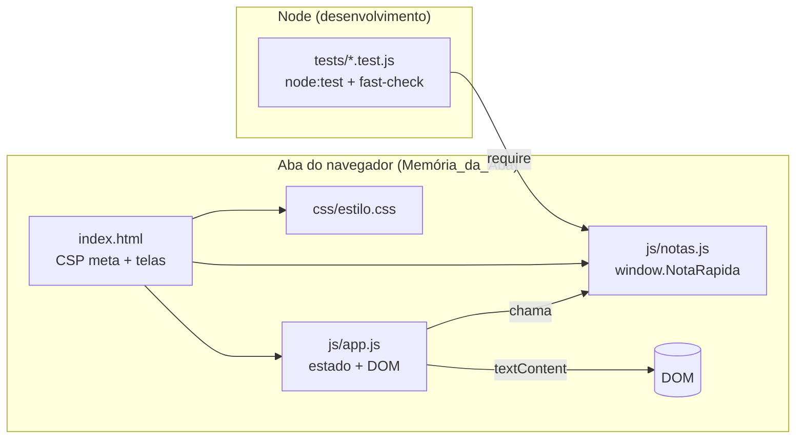
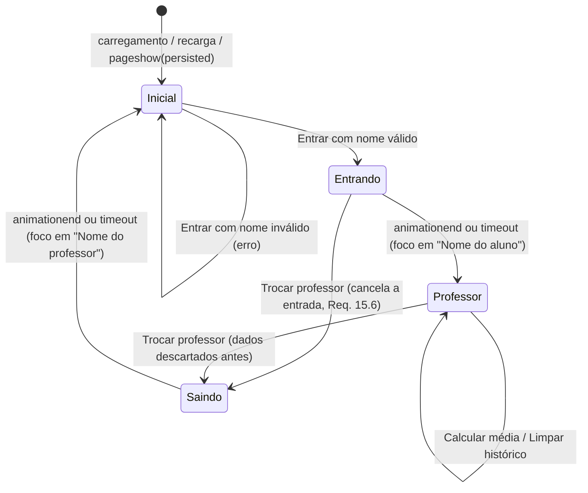

# Design Document

## Overview

O NotaRápida é um site estático de uma página (`site/index.html`) com duas telas: a Tela_Inicial, onde o professor informa o nome, e a Tela_do_Professor, onde ele lança o nome do aluno e as notas T1, T2 e T3 e vê a Média_Final, a Classificação, a Posição_em_Relação_à_Média e os 20 últimos alunos consultados (somente leitura).

Tudo roda no navegador com HTML, CSS e JavaScript puro, sem frameworks, sem dependências de runtime, sem servidor e sem armazenamento persistente. O site abre por `file://` (clique duplo), pelo servidor local do projeto (`npm run servir`, `scripts/servir.js`, sem dependências) ou por um servidor local simples. O visual é inspirado nas cores do Estado do Rio de Janeiro, com aviso permanente de **site não oficial** e sem nenhum símbolo oficial (Req. 23).

O código tem duas camadas:

- **Lógica pura (`site/js/notas.js`)**: Leitor_de_Nota, Validador, Calculadora_de_Média, Formatador_de_Nota, Histórico_Recente (congelado), faixas da média, resumo do histórico, carimbo, recado do dia, data por extenso, mensagens e uma função pura de transição da sessão. Não acessa o DOM. Exportada como `window.NotaRapida` no navegador e por `module.exports` no Node, para os testes.
- **Interface (`site/js/app.js`)**: guarda o estado da sessão em variáveis JS (Memória_da_Aba), trata eventos, renderiza com `textContent`, controla foco, anúncios e animações.

### Decisões principais

| Decisão | Escolha | Motivo |
|---|---|---|
| Aritmética | Notas em centésimos inteiros (0 a 1000); soma S (0 a 3000) | Sem erro de ponto flutuante (Req. 6.6, 6.11) |
| Média_Final exata | Fração S/3 em centésimos (`{ numerador: S, denominador: 3 }`) | Média × 3 = soma exatamente (Req. 6.1, 6.11) |
| Classificação | Compara S com 1800, 2400 e 2700 | Usa o valor exato, sem divisão (Req. 6.6) |
| Média exibida | `floor(S / 3)` centésimos, com vírgula e 2 casas (S = 1799 → 599 → "5,99") | Truncamento sem arredondar (Req. 8.5). Como 1800, 2400 e 2700 são múltiplos de 3, a média truncada fica sempre na mesma faixa da exata (Req. 6.13) |
| Scripts | Clássicos, externos, `defer`, sem `import`/`export`, caminhos relativos | Funciona em `file://` (Req. 22.5, 22.7) |
| Telas | Duas `<section>` na mesma página, alternadas com `hidden` + `inert` | Sem mudança de URL nem de histórico (Req. 19.9, 2.7, 2.8) |
| Estado | Variáveis em uma IIFE de `app.js` | Nada em cookies, localStorage, sessionStorage, IndexedDB ou service worker (Req. 19.2) |
| Dados na página | Somente `textContent`, `createElement`, `replaceChildren` | Nenhum dado digitado vira HTML (Req. 20.1) |
| Animações | Classes CSS com `@keyframes` (`opacity` e `transform`), fim por `animationend` + timeout de segurança | Compatível com a CSP (sem estilo inline) e leve (Req. 17.6) |
| Testes | `node:test` + `fast-check` 4.10.2 (devDependency, versão fixa) em `tests/` | Nenhum arquivo de teste é carregado pela página (Req. 16.3, 16.4) |
| Histórico | 20 Lançamentos, lista e registros congelados (`Object.freeze` profundo), tabela sem controles de edição | Registros somente leitura (Req. 9.11, 9.12, 20.14) |
| Temas | Classes `tema--neutro/feminino/masculino` no `<body>` e na `#tela-professor`; cada tema redefine variáveis de cor, degradês e sombras | Aparência por Tratamento sem estilo inline (Req. 11.7) |
| Identidade | Faixa, cartão e rodapé "Site não oficial"; motivo geométrico próprio, sem brasão (Req. 23) | Não ser confundido com site do governo |
| Foco em toque | `ehTelaDeToque()` (`pointer: coarse`): sem foco automático em "Nome do aluno"; teclado fechado e rolagem até o resultado | O teclado virtual cobria o resultado (Req. 2.5, 4.6) |
| Data | `formatarDataExtenso` feita à mão, sem `Intl` | A primeira chamada ao `Intl` custa dezenas de ms em celulares modestos (Req. 24.5) |
| Servidor local | `scripts/servir.js`: tudo em memória, comprimido uma vez, rotas fechadas, limites por endereço | 30+ professores simultâneos com segurança (Req. 25) |
| Publicação | Actions presas a commit, permissões mínimas por job | Cadeia de publicação segura (Req. 26) |

### Pesquisa que orienta o design

- **CSP `'self'`** libera recursos da mesma origem do documento ([MDN – CSP](https://developer.mozilla.org/en-US/docs/Web/HTTP/Guides/CSP)). Em `file://` a origem não é uma origem HTTP comum, e o resultado depende do navegador. Sem `'unsafe-inline'`, a CSP bloqueia `<script>`/`<style>` inline, atributos `on*` e atributos `style`; mudar classes por JS não é afetado.
- **Firefox e `file://`**: o Firefox trata cada documento `file://` como origem única (preferência `privacy.file_unique_origin`), o que bloqueia módulos ES e `fetch` entre arquivos locais e cria o risco de `'self'` não corresponder aos arquivos vizinhos. Scripts clássicos e folhas de estilo comuns não usam CORS, por isso o design evita módulos e `fetch`.
- **Diretivas em `<meta>`**: `frame-ancestors`, `report-uri`, `report-to` e `sandbox` são ignoradas quando a CSP vem em `<meta>` ([MDN – CSP](https://developer.mozilla.org/en-US/docs/Web/HTTP/Guides/CSP)). Quando houver CSP em cabeçalho e em `<meta>`, vale a combinação mais restritiva.
- **bfcache**: ao voltar pela navegação, o navegador pode restaurar a página da memória; `pageshow` com `event.persisted === true` indica esse caso ([web.dev – bfcache](https://web.dev/articles/bfcache)).
- **fast-check**: a linha atual é a 4.x (a 4.10 prepara a migração para a v5) ([blog do fast-check](https://fast-check.dev/blog/)). A versão exata é fixada no `package.json` e confirmada com `npm view fast-check version` na instalação.

*O conteúdo das fontes foi parafraseado para respeitar restrições de licenciamento.*

## Architecture

### Estrutura de arquivos

```
Projeto-NotaRapida/
├── site/                         ← tudo o que a página carrega (≤ 204.800 bytes, Req. 16.3)
│   ├── index.html                ← CSP em <meta>; faixa "site não oficial"; as duas telas; sprite SVG
│   ├── css/estilo.css            ← Guia_Visual (variáveis), temas, layout, estados, animações
│   ├── js/notas.js               ← lógica pura → window.NotaRapida / module.exports
│   ├── js/app.js                 ← estado em memória, DOM, eventos, foco, transições
│   ├── img/icone.svg             ← favicon e logo (evita 404 de /favicon.ico)
│   ├── img/ilustracao.svg        ← ilustração decorativa da Tela_Inicial (própria, sem símbolo oficial)
│   ├── robots.txt  ai.txt        ← pedidos aos robôs de IA (melhor esforço)
│   └── _headers                  ← cabeçalhos para Netlify/Cloudflare e para scripts/servir.js (ignorado no GitHub Pages)
├── scripts/servir.js             ← servidor local sem dependências (Req. 25)
├── tests/                        ← só Node; nunca referenciado pelo index.html
│   ├── leitor-validador.test.js  propriedades.test.js  injecao.test.js
│   ├── historico-somente-leitura.test.js  entradas-adversariais.test.js
│   └── estatico.test.js  servidor.test.js  supply-chain.test.js
├── .github/workflows/pages.yml   ← testa e publica site/ no GitHub Pages
├── package.json                  ← "test": "node --test \"tests/**/*.test.js\"" e "servir": "node scripts/servir.js"
└── AulaPython-TRABALHOCONCLUIDO.py
```

Tamanho sem minificação: HTML ≈ 23 KB, CSS ≈ 47 KB, `notas.js` ≈ 26 KB, `app.js` ≈ 31 KB, ícone e ilustração ≈ 4 KB. Total ≈ 131 KB (130.866 bytes), abaixo do limite de 200 KB; com brotli, uma visita completa baixa 29.033 bytes (gzip: 32.762).

### Camadas



- `notas.js` não usa `window`, `document`, temporizadores nem armazenamento; recebe strings/números e devolve objetos novos, sem mutar argumentos.
- `app.js` é o único que toca o DOM e guarda estado.
- Ordem no `<head>`: `<script src="js/notas.js" defer>` e depois `<script src="js/app.js" defer>`. `defer` preserva a ordem.

### Exportação de `notas.js`

```js
(function (raiz, fabrica) {
  'use strict';
  var api = fabrica();
  if (typeof module === 'object' && module && module.exports) {
    module.exports = api;            // Node (testes)
  } else {
    raiz.NotaRapida = api;           // navegador
  }
})(typeof globalThis !== 'undefined' ? globalThis : this, function () {
  'use strict';
  // implementação
  return Object.freeze({ /* API em Components and Interfaces */ });
});
```

### Telas e transições



Acionamentos repetidos de "Entrar" ou "Trocar professor" durante a transição do mesmo botão são ignorados (`transicao.emCurso` + `inert` na tela que sai, Req. 15.4).

### Fluxo de "Calcular média"

```mermaid
sequenceDiagram
  actor P as Professor
  participant A as app.js
  participant N as NotaRapida
  participant D as DOM
  P->>A: submit (botão ou Enter)
  A->>A: preventDefault()
  A->>N: reduzir(estado, {CALCULAR, campos})
  alt inválido
    N-->>A: FORMULARIO_INVALIDO {erros, primeiroInvalido}
    A->>D: limpa erros, mostra novos, aria-invalid, foco no 1º inválido
  else válido
    N-->>A: CALCULO_CONCLUIDO {lancamento}
    A->>D: renderiza painel e histórico (conteúdo final)
    A->>D: esvazia campos; foco em "Nome do aluno" (em tela de toque, fecha o teclado)
    A->>D: rola até o resultado se ele estiver abaixo de 60% da janela
    A->>D: anuncia mensagem (aria-live)
    A->>D: adiciona classes de animação (200 ms)
  end
```

O conteúdo final é escrito antes da animação (Req. 17.4). As animações só mexem em `opacity` e `transform`; interromper uma animação deixa a tela no estado final (Req. 10.12, 17.5).

### Política de Segurança de Conteúdo

`<meta http-equiv="Content-Security-Policy">` logo após `<meta charset="utf-8">`, antes de qualquer `<link>` ou `<script>` (Req. 20.9):

```
default-src 'none'; script-src 'self'; style-src 'self'; img-src 'self';
font-src 'none'; connect-src 'none'; object-src 'none'; frame-src 'none';
worker-src 'none'; manifest-src 'none'; base-uri 'none'; form-action 'none';
require-trusted-types-for 'script'; trusted-types 'none'
```

| Diretiva | Efeito | Req. |
|---|---|---|
| `default-src 'none'` | Bloqueia tudo que não for liberado | 20.2 |
| `script-src 'self'` | Só `notas.js` e `app.js`; bloqueia inline, `on*` e `eval`/`new Function` | 20.2, 20.3 |
| `style-src 'self'` | Só `estilo.css`; bloqueia `<style>` e `style="..."` | 20.2 |
| `img-src 'self'` | Só `icone.svg` e `ilustracao.svg` (os ícones do sprite são SVG inline, sem requisição) | 20.2, 23.4 |
| `font-src 'none'` | Nenhum arquivo de fonte (só fontes do sistema) | 10.2 |
| `connect-src 'none'` | Bloqueia `fetch`, XHR, WebSocket, `sendBeacon` | 14.6, 19.3 |
| `object-src`, `frame-src`, `worker-src 'none'` | Sem plugins, quadros, workers ou service workers | 19.2, 20.2 |
| `base-uri 'none'`, `form-action 'none'` | Sem `<base>`; nenhum formulário é enviado | 19.9, 20.2 |
| `require-trusted-types-for 'script'`, `trusted-types 'none'` | Trusted Types: nos navegadores que suportam, qualquer atribuição de string a `innerHTML`, `eval` e afins é bloqueada, e nenhuma política pode ser criada | 20.1, 20.2 |

**Risco de `'self'` em `file://`.** No servidor local, `'self'` corresponde a `http://localhost:porta` e libera os arquivos do site. Em `file://`, o Chrome e o Edge costumam aceitar arquivos da mesma pasta, mas no Firefox (origem única por arquivo) e no Safari o comportamento precisa ser confirmado. Se `'self'` não corresponder, a página aparece sem estilo e sem JS, com violações de CSP no console.

**Verificação manual obrigatória** (antes de concluir a implementação): abrir `site/index.html` por clique duplo no Firefox, Chrome, Edge e Safari; abrir o console e recarregar; confirmar ausência de mensagens de CSP e de erros de carregamento; confirmar que a Tela_Inicial aparece com o Guia_Visual e que "Entrar" funciona. Repetir pelo servidor local (ex.: `python -m http.server 8080 --directory site`).

**Contingência**: se algum navegador bloquear em `file://`, acrescentar `file:` a `script-src`, `style-src` e `img-src`. No modo HTTP isso não libera nada (páginas `http:` não carregam `file:`); em `file://` amplia a origem permitida, risco aceitável porque nenhum dado é inserido como HTML. As demais restrições continuam. A decisão fica registrada em comentário no topo do `index.html` e neste documento.

### Hospedagem no GitHub Pages (dentro do escopo)

A hospedagem deixou de estar fora do escopo: o site é publicado no GitHub Pages (Req. 20.7, 20.8, 22).

- Repositório: https://github.com/AlanSouzaDev7/Projet.Site_NotaRapida
- URL pública: https://alansouzadev7.github.io/Projet.Site_NotaRapida/ (HTTPS com o certificado do `github.io`)
- `.github/workflows/pages.yml`: a cada push em `main` (ou manualmente), o job `testar` roda `npm ci --ignore-scripts` e `npm test` no Node 24; só se passar, o job `publicar` envia **somente a pasta `site/`** com `upload-pages-artifact` + `deploy-pages`. Endurecimento (Req. 26): cada action presa a um **commit** de 40 caracteres (a tag `v7` poderia ser movida por quem controla o repositório da action; um commit não), `permissions: {}` no topo e só o necessário em cada job (testes: `contents: read`; publicação: `pages: write` e `id-token: write`), `timeout-minutes`, `persist-credentials: false`, gatilhos só `push` em `main` e manual (nunca `pull_request_target`), nenhum segredo. Atualizar uma action é trocar o commit conferindo a versão; `tests/supply-chain.test.js` falha se uma action voltar a usar tag.

**Anti-quadro por script.** O GitHub Pages não aceita cabeçalhos personalizados, e `frame-ancestors` é ignorado em `<meta>`. Por isso `app.js` testa, no início, se a página está dentro de um quadro (`window.top !== window.self`, erro de acesso conta como quadro); se estiver, adiciona `html.em-quadro`, o CSS esconde `.palco`, o aviso `#aviso-quadro` aparece e o NotaRápida não é iniciado. É uma proteção de melhor esforço contra clickjacking (não funciona com JS desativado).

**`site/_headers`.** Contém a CSP com `frame-ancestors 'none'`, HSTS, `X-Content-Type-Options: nosniff`, `Referrer-Policy`, `Permissions-Policy`, `Cross-Origin-Opener-Policy: same-origin`, `Cross-Origin-Embedder-Policy: require-corp`, `Cross-Origin-Resource-Policy: same-origin`, `X-Frame-Options: DENY`, `X-Robots-Tag` e afins. Vale em Netlify ou Cloudflare Pages e é lido também por `scripts/servir.js` (sem o HSTS, porque o servidor fala HTTP); no GitHub Pages é ignorado e valem apenas a CSP em `<meta>` e o anti-quadro do script. O próprio `_headers` nunca é servido pelo `servir.js`.

**Robôs de IA (melhor esforço).** `site/robots.txt`, `site/ai.txt` e `<meta name="robots" content="noai, noimageai">` pedem que robôs de IA não coletem o site. São só pedidos: robôs podem ignorá-los, e o `robots.txt` só é lido na raiz do domínio, então em `alansouzadev7.github.io/Projet.Site_NotaRapida/` ele não é consultado (vale com domínio próprio). Nenhum dado de professor ou aluno sai da aba, então não há dado do usuário a proteger por esse meio.

## Components and Interfaces

### 1. `site/index.html`

Estrutura resumida (ids usados por `app.js`; a lista completa de ids é conferida por `tests/estatico.test.js`):

```html
<!doctype html>
<html lang="pt-BR">
<head>
  <meta charset="utf-8">
  <meta http-equiv="Content-Security-Policy" content="default-src 'none'; script-src 'self'; ...">
  <meta name="viewport" content="width=device-width, initial-scale=1">
  <meta name="referrer" content="no-referrer">
  <meta name="robots" content="noai, noimageai">
  <meta name="description" content="NotaRápida: calculadora independente e não oficial da média trimestral ...">
  <meta name="theme-color" content="#082F66">
  <meta name="color-scheme" content="only light">
  <title>NotaRápida – Entrar</title>
  <link rel="icon" href="img/icone.svg" type="image/svg+xml">
  <link rel="stylesheet" href="css/estilo.css">
  <script src="js/notas.js" defer></script>
  <script src="js/app.js" defer></script>
</head>
<body class="tema--neutro">
  <svg class="sprite" aria-hidden="true" focusable="false">
    <!-- <symbol id="i-calculadora | i-bandeira | i-lista | i-cadeado | i-escudo | i-info |
         i-troca | i-livro | i-estrela | i-lixeira"> -->
  </svg>
  <noscript><p class="aviso-noscript">Ative o JavaScript para usar o NotaRápida.</p></noscript>
  <p id="aviso-quadro" class="aviso-quadro" role="alert" hidden>O NotaRápida não pode ser exibido dentro de outro site.</p>
  <a class="pular" href="#conteudo">Ir para o conteúdo</a>

  <div class="pagina">
    <header class="faixa-gov" aria-label="Aviso: site não oficial">
      <!-- bandeirola decorativa, texto "Projeto independente, inspirado nas cores do Estado do
           Rio de Janeiro. Sem vínculo com o Governo do Estado." e o selo "Site não oficial" -->
    </header>

    <main id="conteudo" class="palco" tabindex="-1">
      <section id="tela-inicial" class="tela tela--inicial" aria-labelledby="titulo-app">
        <div class="entrada">
          <div class="apresentacao">
            <!-- logo, h1#titulo-app "NotaRápida", chamada, 4 benefícios com ícone e
                 ilustração (width/height fixos, loading="lazy", oculta abaixo de 900px) -->
          </div>
          <div class="cartao cartao--entrada">
            <form id="form-entrada" novalidate>
              <!-- #campo-professor + #erro-professor; fieldset.tratamento: três rádios
                   (feminino, masculino, neutro marcado) com amostra e nome do tema;
                   botão "Entrar" -->
            </form>
            <!-- .nota-privacidade e .nota-oficial -->
          </div>
        </div>
      </section>

      <section id="tela-professor" class="tela tela--professor tema--neutro"
               aria-labelledby="saudacao" hidden inert>
        <header class="cabecalho">
          <!-- #homenagem (oculta), #saudacao-periodo, h1#saudacao, subtítulo e a lousa
               "Recado do dia" (#recado-texto, #recado-autor) -->
        </header>
        <p class="aviso-dados">Nada é salvo. ... Apenas os 20 últimos alunos consultados aparecem,
          e esses registros são somente para leitura.</p>
        <div class="grade">
          <section class="cartao painel-form">
            <!-- 1. form#form-notas: #campo-media + ul#ajuda-media (legenda das faixas), #campo-aluno,
                 #campo-t1..t3 (inputmode="decimal"), #erro-* e botão "Calcular média" -->
          </section>
          <section id="painel-resultado" class="cartao painel-resultado">
            <!-- 2. #resultado-vazio e #resultado-conteudo: #res-aluno, #res-selo, #res-posicao,
                 #res-carimbo, #res-media, régua SVG (#res-regua), #res-faixas, T1–T3, classificação,
                 #res-metas, #res-mensagem, "Média para aprovação" -->
          </section>
          <section class="cartao painel-historico">
            <!-- 3. "Últimos 20 alunos consultados", etiqueta "Somente leitura", #botao-limpar,
                 dl#resumo, #historico-vazio e table com tbody#historico-corpo -->
          </section>
        </div>
        <div class="acoes">
          <button type="button" id="botao-trocar" class="botao botao--secundario botao--trocar">Trocar professor</button>
        </div>
        <p id="anuncio" class="visualmente-oculto" aria-live="polite" aria-atomic="true"></p>
      </section>
    </main>

    <footer class="rodape"><!-- avisos de site não oficial --></footer>
  </div>
</body>
</html>
```

Notas:

- Sem `<style>`, sem atributos `style` e sem `on*` (Req. 20.2). A Tela_do_Professor começa com `hidden inert`, e o CSS no `<head>` bloqueia a renderização, então nada aparece sem estilo (Req. 16.5).
- Ícones: `<svg><use href="#i-…"/></svg>` apontam para símbolos do sprite do próprio documento (sem requisição); todos têm `aria-hidden="true"` e o teste confirma que cada `href` aponta para um símbolo existente.
- A régua do resultado é desenhada só com atributos SVG (`x`, `width`, `transform`): a CSP proíbe estilo inline e o app evita o CSSOM (`style.*`).
- Notas com `type="text"` + `inputmode="decimal"`: teclado numérico no celular e aceitação de qualquer caractere (Req. 4.8). `type="number"` rejeitaria a vírgula em alguns navegadores.
- `maxlength="1000"` descarta o excedente ao digitar ou colar, sem mensagem (Req. 1.12, 20.4). `autocomplete="off"` desativa sugestões (Req. 19.8), inclusive nos rádios de Tratamento.
- O botão "Trocar professor" é o último focável no DOM e o CSS o posiciona no topo: a partir de 900px ele fica sobre o cabeçalho (`.acoes` na linha 1 da grade, com `.cabecalho__texto` reservando 58px); abaixo disso, logo após o cabeçalho. A ordem de foco do Req. 21.9 é mantida.
- O único `tabindex` do HTML é o `-1` do `<main>` (alvo do link "Ir para o conteúdo"); a tabela do histórico fica dentro de um `div` sem `tabindex` nem `role`, para não criar parada de foco extra (Req. 21.17).
- Marcos únicos: um banner (a faixa de aviso), um `<main>` e um rodapé (Req. 21.17).
- `#anuncio` é a única região `aria-live`; o painel não é região viva, para o resultado ser lido uma vez (Req. 7.9).
- Viewport sem `maximum-scale` nem `user-scalable=no` (Req. 21.14); `<meta name="color-scheme" content="only light">` (Req. 21.16).

### 2. Guia_Visual (`site/css/estilo.css`, variáveis em `:root`)

Todas as cores ficam em `:root` e nos três blocos de tema; o resto do arquivo só usa variáveis. A identidade se inspira na bandeira do Estado do Rio de Janeiro (campo esquartelado de azul-celeste e branco), mas é um motivo geométrico livre: **nenhum brasão, logomarca ou símbolo oficial** é usado e o site declara em todas as telas que não é oficial (Req. 23). Os contrastes são conferidos por auditoria de pixels em todos os estados e temas (0 falhas) e pelo axe (0 violações).

#### Paleta base (tema neutro)

| Token | Hex | Uso |
|---|---|---|
| `--cor-fundo` / `--cor-superficie` / `--cor-superficie-suave` / `--cor-superficie-funda` | `#EDF3FB` / `#FFFFFF` / `#E9F1FB` / `#F6F9FD` | Fundo da página, cartões e campos, faixas suaves, áreas rebaixadas |
| `--cor-texto` / `--cor-texto-suave` / `--cor-placeholder` | `#12203A` / `#43506A` / `#5B6472` | Texto principal, apoio e "ex.: 7,5" |
| `--cor-borda` / `--cor-borda-campo` | `#D3DDEB` / `#6B7280` | Bordas de cartões; borda padrão dos campos (≥ 3:1 no branco) |
| `--cor-primaria` / `--cor-destaque` / `--cor-destaque-suave` | `#0B4FA6` / `#082F66` / `#E5EFFB` | Botões, links e foco; botão sob o ponteiro; fundo do secundário sob o ponteiro |
| `--cor-acento` / `-claro` / `-suave` | `#F5B820` / `#FFEDB0` / `#FFF5D6` | Dourado: selo "Site não oficial", detalhes e homenagem |
| `--cor-aviso-*` | fundo `#FFF5D6`, borda `#F0D68A`, texto `#5A4100`, ícone `#8A6200` | Avisos em tom de ouro (aviso de dados, Dia do Professor) |
| `--gov-*` | fundo `#06264F`, texto `#E6EEF9`, celeste `#5AA9E6`, selo `#F5B820` com texto `#3A2A00` | Faixa de aviso e rodapé: iguais em qualquer tema |

**Situações (iguais nos três temas, Req. 11.9):** `--cor-erro` e `--cor-reprovado` `#B91C1C`, `--cor-aprovado` `#15803D`, `--cor-andamento` `#475569`. **Faixas da régua:** reprovado `#D64545`, na média `#E0A526`, acima `#2FA062`, excelente `#0E7C86`. **Carimbos:** reprovado `#B91C1C`, aprovado `#15803D`, acima `#0E7C86`, excelente `#8A5A00`, em andamento `#475569`.

#### Temas (Req. 11.7)

Classes `tema--neutro`, `tema--feminino` e `tema--masculino` no `<body>` e na `#tela-professor`; cada uma redefine só as variáveis que dependem do tema. `.tela--inicial` redefine os valores neutros, então a Tela_Inicial é sempre neutra.

| Tema | Nome na tela | Primária | Destaque | Acento | Fundo | Degradê do cabeçalho |
|---|---|---|---|---|---|---|
| neutro | azul clássico | `#0B4FA6` | `#082F66` | `#F5B820` | `#EDF3FB` | `#062B5C → #0B4FA6 → #1672C4` |
| feminino | ameixa e lilás | `#9D2A68` | `#6E1D4A` | `#F4A98C` | `#FAF3F8` | `#4F1745 → #9D2A68 → #7B5BC0` |
| masculino | azul-petróleo | `#1B4965` | `#0F2C41` | `#D08B3E` | `#EDF2F5` | `#0A1E33 → #1B4965 → #2F7391` |

Cada tema traz também o degradê dos botões (`--grad-botao` e `--grad-botao-hover`), o degradê de acento, o fundo (`--grad-fundo`, dois gradientes radiais) e a cor das sombras (`--sombra-rgb`), todos da mesma família de cor.

#### Tipografia

- `--fonte: system-ui, "Segoe UI", Roboto, Arial, sans-serif;` (só fontes do sistema, sem `@font-face`, termina em família genérica, Req. 10.2) e `--fonte-citacao: Georgia, "Times New Roman", serif;` para o recado do dia.
- Escala: `--tam-micro` e `--tam-pequeno` 14px (rótulos, avisos, cabeçalhos de tabela), `--tam-base` 16px (texto, botões e **todos os campos**, Req. 21.13), `--tam-h2` 20px, `--tam-saudacao` `clamp(26px, 4vw, 36px)`, `--tam-marca` `clamp(30px, 4vw, 38px)` e `--tam-media` 48px (40px abaixo de 640px). Nenhum texto fica abaixo de 14px, com uma única exceção: o texto do carimbo decorativo (11px; 10px abaixo de 640px), que é uma ilustração oculta para tecnologias assistivas e repete o selo. O teste de `estatico.test.js` confere todas as declarações de `font-size`.
- Nomes e mensagens com `overflow-wrap: anywhere` e `unicode-bidi: isolate`, para nomes de 100 caracteres sem espaço quebrarem linha sem truncar e para textos com caracteres de direção (RTL) não embaralharem o que está ao redor (Req. 2.1, 9.4, 21.1).

#### Espaçamento, raios, gradientes e sombras

- Espaçamento: `--esp-1` 4px, `--esp-2` 8px, `--esp-3` 12px, `--esp-4` 16px, `--esp-5` 24px, `--esp-6` 32px, `--esp-7` 48px.
- Raios: `--raio-p` 10px (campos, botões), `--raio-m` 14px, `--raio-g` 18px (cartões), `--raio-xg` 24px (painel de entrada), `--raio-pilula` 999px (selos).
- Profundidade (Req. 23.6): `--sombra-cartao` em quatro camadas (reflexo interno claro, sombra de contato e duas sombras longas e suaves), `--sombra-hero` para o cabeçalho e o painel de entrada e `--sombra-botao`; degradês `--grad-hero` (com padrão de pontos `--padrao-hero`), `--grad-botao`, `--grad-acento`, `--grad-fundo` e `--grad-homenagem`.
- Campos com `min-height: 46px` e botões, rádios e o link "Ir para o conteúdo" com 44px no mínimo (Req. 21.10). Bordas de 2px que não mudam de espessura no erro.

#### Estados

| Elemento | Normal | Ponteiro sobre (só `@media (hover: hover)`) | Foco | Erro |
|---|---|---|---|---|
| Campo | Borda 2px `--cor-borda-campo` | – | `:focus`: borda `--cor-primaria` e `outline: 3px solid var(--cor-foco); outline-offset: 2px` (também no foco posto pelo script) | Borda `--cor-erro`, `aria-invalid="true"`, mensagem abaixo |
| Botão primário | `--grad-botao`, texto branco | `--grad-botao-hover` | `:focus-visible`: mesmo anel | – |
| Botão secundário | Fundo branco, texto e borda `--cor-primaria` | Fundo `--cor-destaque-suave`, texto e borda `--cor-destaque` | Mesmo anel | – |
| "Trocar professor" (≥ 900px, sobre o cabeçalho) | Texto branco, fundo e borda translúcidos | Fundo mais claro | Anel branco | – |

Todo `:hover` está dentro de `@media (hover: hover)` (Req. 21.15, conferido pelo teste). Os cartões usam `overflow: hidden` (para conter fundos e cantos arredondados), mas o preenchimento interno de 24px é maior que o anel de foco (3px + 2px de afastamento), então o anel nunca é cortado.

#### Layout

- `.pagina` com altura mínima da janela (`100vh` e `100dvh`) e `.palco { position: relative }`; as duas telas ocupam a mesma célula durante a transição.
- Tela_Inicial: `.entrada` (até 1.080px). Abaixo de 900px, apresentação e cartão em coluna; a partir de 900px, lado a lado, formando um único painel com duas colunas (`1.1fr` e `.9fr`), alinhado ao topo da página (Req. 10.3).
- Tela_do_Professor: cabeçalho com a saudação à esquerda e a lousa do recado à direita (≥ 900px); abaixo, o aviso de dados e `.grade`. A partir de 1024px a grade tem duas colunas (`5fr` e `6fr`) com áreas `"form resultado" "historico historico"` (Req. 10.4); abaixo disso, uma coluna: formulário, resultado, histórico (Req. 10.5).
- T1, T2 e T3 em 3 colunas a partir de 480px; empilhadas abaixo disso. O resumo do histórico tem 5 colunas a partir de 720px.
- **Histórico:** tabela a partir de 900px; abaixo disso, `.tabela`, `tbody`, `tr`, `th` e `td` viram `display: block` e o cabeçalho da tabela fica visualmente oculto (cada linha vira uma ficha por aluno).
- `html { overscroll-behavior-y: contain }`, `color-scheme: only light` e blocos para `forced-colors: active` e `prefers-reduced-motion: reduce` (Req. 21.16 e 21.18).

Esboço – Tela_Inicial (≥ 900px):

```
┌──────────────────────────────────────────────────────────────────────┐
│▒ Projeto independente, inspirado nas cores do Estado do Rio de       │
│  Janeiro. Sem vínculo com o Governo do Estado.   [SITE NÃO OFICIAL] │
├──────────────────────────────────────────────────────────────────────┤
│  ┌──────────────────────────────┬─────────────────────────────────┐  │
│  │ NotaRápida                   │  Entrar                         │  │
│  │ A média trimestral dos seus  │  Nome do professor              │  │
│  │ alunos, em poucos segundos.  │  [___________________________]  │  │
│  │  ◦ Média e situação na hora  │  Como prefere ser chamado(a)?   │  │
│  │  ◦ Quanto falta              │  (Professora)(Professor)(Neutro)│  │
│  │  ◦ Últimos 20 alunos         │  [           Entrar          ]  │  │
│  │  ◦ Nada é salvo              │  Nada é salvo · Site não oficial│  │
│  └──────────────────────────────┴─────────────────────────────────┘  │
│  Site não oficial. Projeto independente, sem vínculo com o Governo… │
└──────────────────────────────────────────────────────────────────────┘
```

Esboço – Tela_do_Professor, largura ≥ 1024px:

```
┌──────────────────────────────────────────────────────────────────────┐
│ faixa "Site não oficial"                                             │
├──────────────────────────────────────────────────────────────────────┤
│ ▓▓ Boa noite · Domingo, 4 de outubro            ┌ Recado do dia ───┐ │
│ ▓▓ Olá, Prof. Ana Souza                         │ “Ensinar é …”    │ │
│ ▓▓ [Trocar professor]   (cabeçalho em degradê)  └──────────────────┘ │
│ 🔒 Nada é salvo. ... Apenas os 20 últimos alunos consultados ...     │
│ ┌─ ① Lançar notas ──────────────┐  ┌─ ② Resultado ───────────────┐   │
│ │ Média para aprovação [6,00]   │  │ Maria Oliveira   (carimbo)  │   │
│ │ ▪ Reprovado 0,00 a 5,99 ...   │  │ (Aprovado) (Na média)       │   │
│ │ Nome do aluno [____________]  │  │ Média final  7,16           │   │
│ │ T1 [___]  T2 [___]  T3 [___]  │  │ ├──┤▼ régua 0 ─── 10        │   │
│ │ [      Calcular média       ] │  │ T1 7,50 · T2 6,00 · T3 8,00 │   │
│ └───────────────────────────────┘  │ Parabéns Maria Oliveira, … │   │
│                                    └─────────────────────────────┘   │
│ ┌─ ③ Últimos 20 alunos consultados ──── [Somente leitura][Limpar] ──┐│
│ │ Consultados 3 de 20 · Aprovados 2 · Reprovados 1 · Média 6,90    ││
│ │ Aluno        T1    T2    T3   Média  Situação    Média p/ aprov. ││
│ │ Maria …      7,50  6,00  8,00 7,16   Aprovado    6,00            ││
│ └───────────────────────────────────────────────────────────────────┘│
│ Site não oficial … (rodapé)                                          │
└──────────────────────────────────────────────────────────────────────┘
```

Abaixo de 1024px a mesma ordem vira uma coluna: cabeçalho (saudação e recado), "Trocar professor", aviso, Lançar notas, Resultado, Últimos 20 alunos consultados (fichas, abaixo de 900px).

#### Resultado e histórico

- Rótulo de situação (`.selo`): pílula, texto branco; `.selo--aprovado` (`--cor-aprovado`) para as três aprovações, `.selo--reprovado` (`--cor-reprovado`) e `.selo--andamento` (`--cor-andamento`) (Req. 7.6). As mesmas classes colorem a situação no histórico (Req. 10.13).
- Indicador de posição (`.indicador`): pílula clara com borda, texto "Abaixo da média", "Na média" ou "Acima da média" (Req. 7.7).
- Régua: SVG `viewBox="0 0 320 40"` com quatro retângulos recortados por `clipPath` (uma faixa por classificação, posicionados só por atributos `x` e `width`), seta (`#reg-marcador`, movida por `transform`) e as pontas "0" e "10". Escala `ESCALA_REGUA = 320 / 1000` por centésimo. O texto equivalente fica em `#res-regua-rotulo` (Req. 7.12).
- Carimbo: círculo girado, `aria-hidden="true"`, com o texto da Classificação e a cor do tom (Req. 7.13).
- Histórico: `<table>` com `<caption>` oculta, cabeçalhos `scope="col"` e uma linha por Lançamento; Lançamentos em andamento têm a barra lateral `--cor-andamento`, "Média parcial {p}" e o resumo "Aprovação: … · Acima: …" (Req. 13.8). Resumo (`dl#resumo`): Consultados (de 20), Aprovados, Reprovados, Em andamento e Média do grupo (Req. 9.13).

#### Animações

| Animação | Duração | Keyframes | Req. |
|---|---|---|---|
| Transição_de_Tela – sai | 300 ms, `cubic-bezier(.2,0,.2,1)` | `opacity 1→0`, `translateY(0→-8px)` | 17.1 |
| Transição_de_Tela – entra | 300 ms (simultânea) | `opacity 0→1`, `translateY(12px→0)` | 17.1 |
| Animação_de_Resultado | 200 ms, `ease-out` | `#resultado-conteudo`: `opacity 0→1`, `translateY(6px→0)` | 17.2 |
| Animação_de_Histórico | 200 ms, `ease-out` | Item novo: `opacity 0→1`, `translateY(-6px→0)`; ao limpar, `#historico-vazio`: `opacity 0→1` | 17.7 |

Classes: `.tela--saindo`, `.tela--entrando`, `.anim-resultado`, `.anim-historico`. Durações em variáveis (`--dur-tela: 300ms`, `--dur-curta: 200ms`). Só `opacity` e `transform` animam (a rolagem até o resultado é a única exceção de movimento, feita pelo navegador).

```css
@media (prefers-reduced-motion: reduce) {
  :root { --dur-tela: 0.01s; --dur-curta: 0.01s; }
  .botao { transition: none; }
}
```

Com Movimento_Reduzido, a duração cai para 10 ms (≤ 0,01 s, Req. 10.11) e `animationend` continua disparando, então a mesma lógica de finalização vale nos dois modos (Req. 10.12). A rolagem até o resultado usa `behavior: 'auto'` nesse modo.

Regras do controlador de animação (`app.js`):

- `animar(el, classe, aoTerminar)`: remove a classe, força reflow (`void el.offsetWidth`), adiciona a classe, espera `animationend` com `e.target === el` e arma um timeout de segurança (`duração + 100 ms`). A finalização é idempotente (roda uma vez, seja pelo evento ou pelo timeout).
- Nova animação do mesmo tipo reinicia a classe e cancela o timeout anterior (Req. 17.5).
- Inserção com remoção do mais antigo: o item removido sai do DOM antes da animação, e só o novo item anima, em um único ciclo de 200 ms (Req. 17.7).
- Animações nunca mudam o foco (Req. 17.8).

### 3. `site/js/notas.js` – API (`window.NotaRapida`)

```js
NotaRapida = {
  constantes: { LIMITE_NOME: 100, LIMITE_CAMPO: 1000, TAMANHO_HISTORICO: 20, MEDIA_PADRAO: 600,
                LIMITES_SOMA: { NA_MEDIA: 1800, ACIMA: 2400, EXCELENTE: 2700 } },
  CLASSIFICACOES: ['Reprovado', 'Aprovado – na média', 'Aprovado – acima da média', 'Aprovado – excelente'],
  POSICOES: ['Abaixo da média', 'Na média', 'Acima da média'],
  mensagens: {
    PROFESSOR_VAZIO: 'Informe o nome do professor.',
    ALUNO_VAZIO: 'Informe o nome do aluno.',
    NOME_LONGO: 'O nome deve ter no máximo 100 caracteres.',
    NOTA_VAZIA: 'Informe a nota.',
    NOTA_INVALIDA: 'Digite um número válido (ex.: 7,5).',
    NOTA_FORA: 'A nota deve estar entre 0 e 10.',
    NOTA_CASAS: 'Use no máximo 2 casas decimais.'
  },
  aparar(texto),                 // trim()
  contarCaracteres(texto),       // pontos de código após normalize('NFC')
  lerNota(texto),                // Leitor_de_Nota → ResultadoLeitura
  formatarCentesimos(c),         // 750 → "7,50"; 1000 → "10,00"; 50 → "0,50"
  formatarMedia(soma),           // formatarCentesimos(Math.floor(soma / 3)); 1799 → "5,99"
  validarNomeProfessor(texto),   // { ok: true, nome } | { ok: false, erro }
  validarNomeAluno(texto),       // idem
  validarNota(texto),            // { ok: true, centesimos } | { ok: false, erro }
  validarFormulario(campos),     // { nomeAluno, t1, t2, t3 } → ok + dados | erros + primeiroInvalido
  calcular([c1, c2, c3]),        // → ResultadoCalculo
  classificarSoma(soma),         // → uma das 4 Classificações
  posicionarSoma(soma),          // → uma das 3 Posições
  rotuloSituacao(classificacao), // → 'Reprovado' | 'Aprovado'
  montarMensagem(nome, classificacao, mediaTexto),
  adicionarAoHistorico(lista, lancamento),   // lista congelada: [lancamento, ...lista].slice(0, 20)
  faixasDaMedia(M),              // → [{ chave, rotulo, de, ate }] em centésimos; faixas vazias omitidas
  resumirHistorico(historico),   // → { total, aprovados, reprovados, emAndamento, mediaGrupo } (congelado)
  carimboDoLancamento(lancamento), // → { tom, texto }
  FRASES, fraseDoDia(data), ehDiaDoProfessor(data),   // recado do dia; 15 de outubro
  formatarDataExtenso(data), periodoDoDia(data),      // "Domingo, 4 de outubro"; "Bom dia"/"Boa tarde"/"Boa noite"
  estadoInicial(),
  reduzir(estado, acao)          // → { estado, evento }
}
```

Mensagens de resultado (`montarMensagem`), com o nome inserido como string comum e exibido por `textContent`:

| Classificação | Texto |
|---|---|
| Reprovado | `Infelizmente {nome}, você foi reprovado com a média final de {média}.` |
| Aprovado – na média | `Parabéns {nome}, você foi aprovado com a média final de {média}. Você está na média.` |
| Aprovado – acima da média | `Parabéns {nome}, você foi aprovado com a média final de {média}. Você está acima da média.` |
| Aprovado – excelente | `Parabéns {nome}, você foi aprovado com a média final de {média}. Você é um gênio!` |

Saudação: `'Olá, Prof. ' + nomeProfessor`.

#### Leitor_de_Nota

1. `t = aparar(texto)`; se `t === ''` → `{ tipo: 'vazio' }` (Req. 8.9).
2. Testar `/^(-?)([0-9]+)(?:[.,]([0-9]+))?$/` (Req. 8.7). Sem correspondência → `{ tipo: 'erro' }` (Req. 8.4): `"abc"`, `"7,5,0"`, `"7,"`, `",5"`, `"7 5"`, `"+7"`, `"1e1"`, `"1.000,5"`.
3. Com correspondência → `{ tipo: 'numero', negativo, inteiro, fracao }`, mesmo fora de 0 a 10 ou com mais de 2 casas (Req. 8.8). `inteiro` sem zeros à esquerda (`'0'` se só zeros); `fracao` como digitada.

#### `validarNota` (ordem do Req. 5.10)

1. `vazio` → `NOTA_VAZIA`. 2. `erro` → `NOTA_INVALIDA`.
3. Intervalo decidido nas strings (sem ponto flutuante, aceita até 1.000 dígitos): `zero = inteiro === '0' && !/[1-9]/.test(fracao)`; `fora = (negativo && !zero) || inteiro.length > 2 || Number(inteiro) > 10 || (inteiro === '10' && /[1-9]/.test(fracao))` → `NOTA_FORA`. Assim `"10,00"` e `"-0"` passam; `"10,01"` e `"-0,5"` não.
4. `fracao.length > 2` → `NOTA_CASAS` (`"7,500"` rejeitado, Req. 5.6).
5. Sucesso: `centesimos = Number(inteiro) * 100 + Number((fracao + '00').slice(0, 2))`.

#### Nomes

`nome = aparar(texto)`; `n = contarCaracteres(nome)`; `n === 0` → mensagem de vazio; `n > 100` → `NOME_LONGO`; senão `{ ok: true, nome }` com espaços internos e caracteres preservados (Req. 1.7, 1.11, 5.9). `trim()` cobre espaço, tabulação e quebra de linha.

#### `validarFormulario`

Avalia sempre os quatro campos (Req. 4.3); `erros` só com os inválidos; `primeiroInvalido` na ordem `nomeAluno`, `t1`, `t2`, `t3` (Req. 5.8).

#### `calcular`

```js
soma = c1 + c2 + c3                                  // inteiro 0..3000
media = { numerador: soma, denominador: 3 }          // centésimos, fração exata
mediaTruncada = Math.floor(soma / 3)                 // centésimos exibidos
classificacao = soma < 1800 ? 'Reprovado' : soma < 2400 ? 'Aprovado – na média'
              : soma < 2700 ? 'Aprovado – acima da média' : 'Aprovado – excelente'
posicao = soma < 1800 ? 'Abaixo da média' : soma < 2400 ? 'Na média' : 'Acima da média'
```

### 4. `site/js/app.js` – interface

IIFE com `'use strict'`, sem globais próprias.

| Parte | Responsabilidade |
|---|---|
| `refs` | Elementos obtidos uma vez por `getElementById` |
| `estado` | `EstadoSessao` atual (único estado de dados) |
| `transicao` | `{ emCurso, destino, timeout }` |
| Renderização | `prepararCabecalho`, `renderErros`, `limparErros`, `renderResultado` (com `desenharRegua`, `aplicarCarimbo`, `preencherFaixas`), `inserirNoHistorico`, `renderResumo`, `anunciar`, `limparDadosDaPagina` – só `textContent`/`createElement`/`replaceChildren`/atributos SVG |
| Ambiente | `ehTelaDeToque()` (`(pointer: coarse)`), `movimentoReduzido()`, `revelarResultado()`, `aquecerTelaDoProfessor()` |
| Controladores | `aoEnviarEntrada`, `aoEnviarNotas`, `aoLimparHistorico`, `aoTrocarProfessor` |
| Ciclo de vida | `iniciar` (limpa os campos, garante a Tela_Inicial, foca o campo e agenda o aquecimento), `pagehide`, `pageshow` |

- **Entrar**: `preventDefault()`; se `transicao.emCurso`, ignora. `reduzir(ENTRAR)`. Inválido: remove o erro anterior e mostra o novo, `aria-invalid="true"`, `aria-describedby="erro-professor"`, texto mantido, foco no campo (Req. 1.6, 1.9, 1.10). Válido: saudação via `textContent`, `aplicarTema(tratamento)`, `prepararCabecalho(new Date())` (período, data, recado, homenagem), média inicial e `trocarTela('professor')`.
- **`trocarTela(destino)`**: `emCurso = true`; `inert` na tela que sai já no início (Req. 21.12); tira `hidden`/`inert` da que entra (digitação aceita durante a transição, Req. 17.3); `document.title` = "NotaRápida – Lançamento de notas" ou "NotaRápida – Entrar" (Req. 21.11); `scrollTo(0, 0)`; aplica `.tela--saindo`/`.tela--entrando`. Ao finalizar: `hidden` na tela que saiu, remove classes, `emCurso = false`. Ao finalizar a entrada, esvazia o campo do professor, restaura o Tratamento neutro e foca `#campo-aluno` (Req. 2.5) **somente se não for Tela_de_Toque**. Ao finalizar a saída, a tela do professor volta ao tema neutro e o foco vai para `#campo-professor` (Req. 1.2, 3.2). O tema vai para o `<body>` e para a `#tela-professor`; ao sair, o `<body>` volta ao neutro na hora e a tela do professor mantém as próprias cores até desaparecer (nada recalcula nem repinta durante a saída).
- **Calcular**: `preventDefault()`; `reduzir(CALCULAR, campos)`. `FORMULARIO_INVALIDO`: limpa erros, mostra todos, foco no primeiro inválido; sem anúncio e sem animação (Req. 5.7, 7.10, 10.15). `CALCULO_CONCLUIDO`: renderiza painel, linha do histórico e resumo, esvazia os campos e erros, foco em `#campo-aluno` (em Tela_de_Toque: `blur()` do campo em uso, para fechar o teclado, em vez de focar), `revelarResultado()` (rola até o painel se ele estiver abaixo de 60% da janela), `anunciar(mensagem)` e animações (Req. 4.6, 7.9). Enter em qualquer campo dispara o mesmo `submit` (Req. 4.5).
- **`anunciar(texto)`**: esvazia `#anuncio` e escreve no próximo `requestAnimationFrame`, para que uma mensagem igual à anterior também seja lida (Req. 7.9).
- **Limpar histórico**: se havia itens, esvazia a tabela e o resumo, mostra "Nenhuma nota lançada ainda." e anima; se não, nada muda (Req. 9.7, 9.9, 10.15). O histórico é desenhado só como leitura: cada linha é criada por `createElement`/`textContent` e nenhum controle de edição existe.
- **Aquecimento do primeiro layout**: o primeiro layout da Tela_do_Professor custa cerca de 6 vezes mais que os seguintes em celulares modestos (fontes e texto ainda não usados). `agendarAquecimento()` (`requestIdleCallback` com limite de 2 s, ou `setTimeout` de 600 ms) chama `aquecerTelaDoProfessor()` depois que a Tela_Inicial está interativa: a tela ganha `.tela--aquecendo` (posição absoluta, `visibility: hidden`, sem eventos), perde `hidden`, é forçada a calcular layout (`offsetHeight`) e volta a `hidden`, tudo na mesma tarefa, fora do fluxo, sem pintura e sem ser lida por leitores de tela (Req. 16.7). Só roda com a Tela_Inicial exibida e sem transição em curso.
- **Política de toque**: `ehTelaDeToque()` é a única condição que separa o comportamento de foco de telas de toque e de mouse/teclado (Suposição 6); reverter é trocar essa condição.
- **Trocar professor**: se `emCurso` com destino `inicial`, ignora (Req. 15.4); se destino `professor`, cancela a entrada (Req. 15.6). Antes da transição: cancela animações em curso, `estado = reduzir(TROCAR_PROFESSOR).estado`, esvazia saudação, painel, histórico, `#anuncio`, os cinco campos e erros (Req. 3.1, 3.6, 3.7); depois `trocarTela('inicial')`.
- **Ciclo de vida**: `iniciar()` esvazia os cinco campos (restauração por duplicar/reabrir aba, Req. 18.9, 19.5), garante a Tela_Inicial e foca "Nome do professor". `pagehide` descarta os dados e volta o DOM à Tela_Inicial sem animação. `pageshow` com `event.persisted` repete a limpeza e foca o campo (Req. 19.6). Sem `history.pushState`, sem `location.hash` (Req. 19.9).
- **Console**: nenhuma chamada a `console.*` (Req. 20.5).

### 5. Tratamento, média de aprovação e resultado parcial

#### Tratamento e temas

- Tela_Inicial: grupo de rádios `name="tratamento"` (`feminino`, `masculino`, `neutro`), com `neutro` ("Prefiro não informar") marcado no carregamento, no `pageshow` e após "Trocar professor" (Req. 11.1, 11.2).
- `normalizarTratamento(v)`: qualquer valor fora dos três vira `'neutro'` (Req. 11.3, 11.4). `estado.tratamento` guarda o valor só na Memória_da_Aba.
- `montarSaudacao(nome, tratamento)` → `'Olá, Prof.ª ' + nome` para `feminino` e `'Olá, Prof. ' + nome` nos demais casos (Req. 11.5, 11.6). Substitui a saudação fixa da seção 3.
- `aplicarTema(tratamento)` põe uma única classe de tema no `<body>` e na `#tela-professor`: `tema--feminino` (primária `#9D2A68`, degradê ameixa→lilás no cabeçalho), `tema--masculino` (`#1B4965`, degradê azul-petróleo→azul-aço) ou `tema--neutro` (`#0B4FA6`, degradê de azul) (Req. 11.7; tabela de cores no Guia_Visual). Cada tema só redefine as variáveis que dependem dele (cores primária, de destaque e de acento, fundo, superfícies, bordas, degradês e cor das sombras); aprovado, reprovado, "Em andamento", erro, faixas da régua e carimbos não mudam (Req. 11.9). As três opções da Tela_Inicial mostram uma amostra com o degradê do tema e o nome ("Tema ameixa e lilás", "Tema azul-petróleo", "Tema azul clássico"), decorativos e ocultos para leitores de tela (Req. 11.11).
- `.tela--inicial` redefine as mesmas variáveis com os valores neutros, então a Tela_Inicial é sempre neutra, inclusive na transição de saída (Req. 11.8). Ao encerrar a sessão, `aplicarTema('neutro')` (Req. 11.10).

#### Média de aprovação

- Campo "Média para aprovação" (primeiro do formulário, valor inicial "6,00") com a legenda das faixas (`ul#ajuda-media`, associada por `aria-describedby`; `faixasDaMedia(M)` gera os itens "Reprovado 0,00 a 5,99", "Na média 6,00 a 7,99", "Acima da média 8,00 a 8,99" e "Excelente 9,00 a 10,00"), atualizada no `input` só com valores válidos e só quando M muda (`mediaDaLegenda`) (Req. 12.1–12.4). O painel de resultado mostra a mesma legenda (`#res-faixas`) e a régua da média usada.
- `validarMediaAprovacao(texto)`: mesma leitura de `lerNota`, ordem vazio → conversão → intervalo 1–10 → casas, com as mensagens do Req. 12.5; sucesso → `{ ok: true, centesimos: M }`.
- `limitesDaMedia(M)` → `{ aprovacao: M, acima: A, excelente: E }`, com `A = floor((M + 1000) / 2)` e `E = floor((M + 3000) / 4)` (Req. 12.6). M = 600 → A = 800, E = 900 (Req. 12.9).
- `classificarSoma(S, M)` e `posicionarSoma(S, M)` comparam S com `3M`, `3A` e `3E`, só com inteiros (Req. 12.7). `calcular(notas, M)` passa a devolver também `mediaAprovacao` e `limites`; com M omitido, vale 600. O Lançamento guarda M, exibido como "Média para aprovação: {M}" (Req. 12.10).

#### Resultado parcial

- `validarNotaOpcional(texto)`: campo vazio → `{ ok: true, centesimos: null, faltante: true }`; senão, `validarNota`. Com os três vazios, `validarFormulario` põe "Informe ao menos uma nota." em T1 (Req. 13.2, 13.3).
- `calcularParcial(notas, M)` (k = 1 ou 2 faltantes): `somaConhecida` Sk, média parcial `p = floor(Sk / (3 − k))`, rótulos faltantes e as duas Metas; com k fora de 1–2 devolve `null` (Req. 13.4, 13.5).
- `metaParaAlvo(X, Sk, k)`: `R = 3X − Sk`; `R ≤ 0` → `garantida`; `n = ceil(R / k)` calculado com inteiros (`floor((R + k − 1) / k)`); `n > 1000` → `impossivel`; senão `{ status: 'possivel', centesimos: n }`. Chamada com X = M (aprovação) e X = A (acima da média) (Req. 13.4, 13.6, 13.7).
- Painel e histórico mostram o selo "Em andamento" (`#475569`, igual nos três temas), sem Classificação nem Posição; cada nota faltante aparece como "—" com `aria-hidden="true"` mais um texto visualmente oculto "sem nota" (Req. 13.5, 13.8).

## Data Models

### Representação numérica

| Conceito | Representação | Faixa | Exemplo |
|---|---|---|---|
| Nota_Trimestral | inteiro em centésimos | 0–1000 | "7,5" → 750 |
| Soma S | inteiro | 0–3000 | 599 + 600 + 600 = 1799 |
| Média_Final exata | fração `S/3` centésimos | 0–1000 | 1799/3 = 599,666… |
| Média exibida | `floor(S/3)` centésimos | 0–1000 | 599 → "5,99" |

### ResultadoLeitura

```js
{ tipo: 'vazio' } | { tipo: 'erro' }
| { tipo: 'numero', negativo: boolean, inteiro: string, fracao: string }
```

### ResultadoCalculo

```js
{ soma, media: { numerador: soma, denominador: 3 }, mediaTruncada,
  classificacao, posicao }
```

| S | Média exata | Classificação | Posição | Rótulo |
|---|---|---|---|---|
| 0–1799 | 0 ≤ m < 6 | Reprovado | Abaixo da média | Reprovado |
| 1800–2399 | 6 ≤ m < 8 | Aprovado – na média | Na média | Aprovado |
| 2400–2699 | 8 ≤ m < 9 | Aprovado – acima da média | Acima da média | Aprovado |
| 2700–3000 | 9 ≤ m ≤ 10 | Aprovado – excelente | Acima da média | Aprovado |

### Lançamento

```js
// cálculo completo (parcial: false)
{ id, parcial: false, nomeAluno, notas: [c1, c2, c3], soma, mediaTruncada,
  mediaAprovacao, classificacao, posicao }
// resultado parcial (parcial: true; notas com null nos faltantes)
{ id, parcial: true, nomeAluno, notas, mediaAprovacao, limites, faltantes,
  somaConhecida, mediaParcial, aprovacao, acima }
```

**Somente leitura:** `reduzir` aplica `congelarProfundo(lancamento)` antes de entregá-lo (o objeto, as notas, os limites, as metas e os faltantes são congelados) e `adicionarAoHistorico` devolve uma lista congelada; `HISTORICO_VAZIO` é um array congelado compartilhado. Em modo estrito, qualquer atribuição a um Lançamento ou à lista lança `TypeError` e não altera nada (Req. 9.12, 20.14; testado em `historico-somente-leitura.test.js`).

`id` é sequencial na sessão. Os textos exibidos (notas, média, rótulo, mensagem) são derivados na renderização pelas funções de `notas.js`, então painel e histórico mostram o mesmo texto para o mesmo Lançamento.

### EstadoSessao

```js
{ tela: 'inicial' | 'professor', nomeProfessor: string | null,
  tratamento: 'neutro' | 'feminino' | 'masculino',
  resultado: Lancamento | null, historico: Lancamento[] /* 0..20, mais recente primeiro, congelada */,
  proximoId: number }
```

`estadoInicial()` → `{ tela: 'inicial', nomeProfessor: null, tratamento: 'neutro', resultado: null, historico: [], proximoId: 0 }`. Os textos digitados ficam só nos `<input>` (também Memória_da_Aba).

### Ações de `reduzir(estado, acao)`

| Ação | Pré-condição | Evento | Novo estado |
|---|---|---|---|
| `ENTRAR { texto, tratamento }` | `tela === 'inicial'` | `NOME_INVALIDO { erro }` | inalterado |
| | | `SESSAO_INICIADA` | `tela: 'professor'`, nome aparado, `tratamento` normalizado, demais campos de `estadoInicial()` |
| `CALCULAR { campos }` | `tela === 'professor'` | `FORMULARIO_INVALIDO { erros, primeiroInvalido }` | inalterado |
| | | `CALCULO_CONCLUIDO { lancamento }` | `resultado = lancamento`, `historico = adicionarAoHistorico(...)`, `proximoId + 1` |
| `LIMPAR_HISTORICO` | `tela === 'professor'` | `HISTORICO_LIMPO { haviaItens }` | `historico = []` |
| `TROCAR_PROFESSOR` | `tela === 'professor'` | `SESSAO_ENCERRADA` | `estadoInicial()` |
| fora da pré-condição | – | `IGNORADO` | inalterado |

### package.json (testes e servidor local)

```json
{
  "name": "notarapida",
  "private": true,
  "scripts": {
    "test": "node --test \"tests/**/*.test.js\"",
    "servir": "node scripts/servir.js"
  },
  "devDependencies": { "fast-check": "4.10.2" }
}
```

Versão fixa, sem `^`/`~`. `package.json`, `node_modules/` e `tests/` ficam fora de `site/`.

## Correctness Properties

*A property is a characteristic or behavior that should hold true across all valid executions of a system-essentially, a formal statement about what the system should do. Properties serve as the bridge between human-readable specifications and machine-verifiable correctness guarantees.*

Em resumo: cada propriedade é uma afirmação "para toda entrada válida, X vale", verificada com centenas de entradas geradas pelo fast-check. Todas testam funções puras de `site/js/notas.js` no Node. DOM, foco, animação, CSP e tempos ficam com os testes de exemplo, as verificações estáticas e o checklist manual.

Notação: `c` = nota em centésimos (inteiro 0–1000); `S = c1 + c2 + c3`; "nome válido" = texto que, após `aparar`, tem de 1 a 100 caracteres.

### Property 1: Validação de nomes

*For any* texto `s` (acentos, apóstrofos, marcação como `<b>`/`<script>`, espaços internos e espaço, tabulação ou quebra de linha nas bordas), `validarNomeProfessor(s)` e `validarNomeAluno(s)` aprovam se e somente se `1 ≤ contarCaracteres(aparar(s)) ≤ 100`; quando aprovam, o nome devolvido é exatamente `aparar(s)`; quando reprovam, devolvem a mensagem de vazio ("Informe o nome do professor." ou "Informe o nome do aluno.") para 0 caracteres e "O nome deve ter no máximo 100 caracteres." acima de 100.

**Validates: Requirements 1.4, 1.5, 1.11, 2.6, 5.1, 5.2, 5.9, 20.11**

### Property 2: Gramática do Leitor_de_Nota

*For any* texto `s`, `lerNota(s)` devolve `vazio` se e somente se `aparar(s)` é vazio; devolve `numero` se e somente se `aparar(s)` segue "menos opcional, um ou mais dígitos e, opcionalmente, um único separador (vírgula ou ponto) seguido de um ou mais dígitos" (conferido por um oráculo independente no teste), inclusive fora de 0–10 ou com mais de 2 casas; e devolve `erro` nos demais casos.

**Validates: Requirements 8.3, 8.4, 8.7, 8.8, 8.9**

### Property 3: Prioridade das regras de validação de nota

*For any* texto `s`, `validarNota(s)` produz no máximo uma mensagem, a da primeira regra violada na ordem vazio → conversão → intervalo 0–10 → casas decimais; e aprova se e somente se nenhuma regra é violada, devolvendo `centesimos` inteiro de 0 a 1000 igual a 100 × o valor decimal exato de `s`.

**Validates: Requirements 5.3, 5.4, 5.5, 5.6, 5.10, 8.8, 20.11**

### Property 4: Ida e volta formatar → ler

*For any* nota `c` de 0 a 1000 e *for any* escrita aceita do mesmo valor (vírgula ou ponto, 0 a 2 casas quando representam `c` exatamente, zeros à esquerda, espaços ou tabulações nas bordas), `validarNota(texto)` devolve `centesimos === c`; em particular `validarNota(formatarCentesimos(c)).centesimos === c`.

**Validates: Requirements 8.1, 8.2, 8.3, 8.6**

### Property 5: Formato de exibição com truncamento

*For any* `c` de 0 a 1000, `formatarCentesimos(c)` casa com `/^(0|[1-9][0-9]?),[0-9]{2}$/` (sem zeros à esquerda nem separador de milhar) e representa exatamente `c / 100`; e *for any* `S` de 0 a 3000, `formatarMedia(S) === formatarCentesimos(Math.floor(S / 3))` (ex.: 1799 → "5,99", 2000 → "6,66").

**Validates: Requirements 8.5**

### Property 6: Média_Final exata

*For any* três notas válidas, `calcular` devolve `soma === c1 + c2 + c3`, `media` igual à fração `{ numerador: soma, denominador: 3 }` (logo média × 3 = soma, sem erro de ponto flutuante) e `mediaTruncada` com `3 × mediaTruncada ≤ soma < 3 × (mediaTruncada + 1)`.

**Validates: Requirements 6.1, 6.11**

### Property 7: Média entre a menor e a maior nota

*For any* três notas válidas, `3 × min(c1, c2, c3) ≤ soma ≤ 3 × max(c1, c2, c3)`.

**Validates: Requirements 6.8**

### Property 8: Confluência das 6 ordens

*For any* três notas válidas e *for any* uma das 6 permutações, `calcular` devolve a mesma soma, média, média truncada, Classificação e Posição_em_Relação_à_Média.

**Validates: Requirements 6.9**

### Property 9: Exatamente uma Classificação e uma Posição

*For any* `S` de 0 a 3000, `classificarSoma(S)` é exatamente um dos 4 textos de Classificação e `posicionarSoma(S)` exatamente um dos 3 textos de Posição, ambos iguais a um modelo de referência que compara a média exata `S/300` com 6, 8 e 9 por multiplicação cruzada.

**Validates: Requirements 6.2, 6.3, 6.4, 6.5, 6.6, 6.7, 6.10**

### Property 10: Monotonicidade

*For any* conjuntos válidos `A` e `B` com `B[i] ≥ A[i]` para i = 1, 2, 3, `calcular(B).soma ≥ calcular(A).soma` e a Classificação de `B` é igual ou superior à de `A` na ordem Reprovado < Aprovado – na média < Aprovado – acima da média < Aprovado – excelente.

**Validates: Requirements 6.12**

### Property 11: Média exibida coerente com a Classificação

*For any* três notas válidas, o valor lido de volta de `formatarMedia(soma)` (com `validarNota`) pertence à faixa da Classificação atribuída, isto é, `classificarSoma(3 × mediaTruncada) === classificarSoma(soma)`.

**Validates: Requirements 6.13**

### Property 12: Mensagem de resultado e rótulo

*For any* nome válido `n` e *for any* `S` de 0 a 3000, `montarMensagem(n, classificarSoma(S), formatarMedia(S))` é exatamente o modelo da Classificação correspondente, com `n` inserido literalmente; e `rotuloSituacao` devolve "Reprovado" para Reprovado e "Aprovado" para as três aprovações.

**Validates: Requirements 7.2, 7.3, 7.4, 7.5, 7.6**

### Property 13: Validação simultânea do formulário

*For any* quatro textos `{ nomeAluno, t1, t2, t3 }`, `validarFormulario` devolve para cada campo o mesmo resultado da validação individual, aprova se e somente se os quatro são válidos e, quando reprova, `primeiroInvalido` é o primeiro campo com erro na ordem nomeAluno, t1, t2, t3.

**Validates: Requirements 4.3, 5.7, 5.8**

### Property 14: Entradas inválidas não alteram o estado

*For any* estado alcançável e *for any* `ENTRAR` com nome inválido (na Tela_Inicial) ou `CALCULAR` com formulário inválido (na Tela_do_Professor), `reduzir` devolve um estado igual ao anterior e um evento de erro, sem criar Lançamento nem iniciar sessão.

**Validates: Requirements 1.6, 5.7, 7.10**

### Property 15: Modelo do Histórico_Recente

*For any* sessão e *for any* sequência de `N ≥ 0` envios válidos de `CALCULAR` desde o início da sessão ou desde o último `LIMPAR_HISTORICO` (com repetições idênticas e envios inválidos intercalados), `historico` é igual aos `min(N, 20)` Lançamentos mais recentes em ordem inversa de adição, segundo um modelo de referência (lista sem limite, invertida e cortada em 20); `resultado` é o último Lançamento válido; e cada Lançamento tem nome aprovado (1–100 caracteres), notas de 0 a 1000 e os valores de `calcular`.

**Validates: Requirements 4.4, 4.7, 7.1, 9.1, 9.2, 9.3, 9.6, 20.11**

### Property 16: Limpar histórico

*For any* estado da Tela_do_Professor, inclusive com histórico vazio, `reduzir(estado, LIMPAR_HISTORICO)` devolve `historico` vazio, mantém `nomeProfessor` e `resultado`, e o evento traz `haviaItens === estado.historico.length > 0`.

**Validates: Requirements 9.7, 9.9**

### Property 17: Isolamento entre sessões

*For any* sequência de ações (`ENTRAR`, `CALCULAR`, `LIMPAR_HISTORICO`, `TROCAR_PROFESSOR`) com dados válidos e inválidos e nomes de professor que podem se repetir: logo após cada `TROCAR_PROFESSOR` o estado é igual a `estadoInicial()`; logo após cada `ENTRAR` válido, `nomeProfessor === aparar(texto)`, `resultado === null` e `historico` está vazio; e em todo estado da Tela_do_Professor, `nomeProfessor` é o da sessão atual e `resultado` e todos os Lançamentos do `historico` foram criados na sessão atual (modelo que rastreia os ids criados por sessão).

**Validates: Requirements 1.7, 2.4, 2.9, 3.1, 3.3, 3.4, 18.8, 19.4**

### Property 18: Média de aprovação maior nunca melhora a Classificação

*For any* soma `S` de 0 a 3000 e *for any* médias válidas `M1 ≤ M2` (100 a 1000 centésimos), a Classificação de `classificarSoma(S, M2)` é igual ou inferior à de `classificarSoma(S, M1)` na ordem da Property 10, e a Posição de `posicionarSoma(S, M2)` é igual ou inferior à de `posicionarSoma(S, M1)` na ordem Abaixo < Na média < Acima; ambas iguais a um modelo que compara `S` com `3M`, `3A` e `3E` de `limitesDaMedia`.

**Validates: Requirements 12.6, 12.7**

### Property 19: M = 600 reproduz as faixas do script original

*For any* soma `S` de 0 a 3000, `limitesDaMedia(600)` é `{ aprovacao: 600, acima: 800, excelente: 900 }` e `classificarSoma(S, 600)` e `posicionarSoma(S, 600)` são iguais ao modelo com limites fixos 1800, 2400 e 2700.

**Validates: Requirements 12.9**

### Property 20: Meta mínima, garantida ou impossível

*For any* `k` em {1, 2}, *for any* soma conhecida `Sk` de 0 a `(3 − k) × 1000` e *for any* alvo `X` de 100 a 1000, `metaParaAlvo(X, Sk, k)` devolve: `garantida` se e somente se `Sk ≥ 3X`; `impossivel` se e somente se `Sk + k × 1000 < 3X`; e, nos demais casos, `possivel` com `n` inteiro de 1 a 1000 tal que `Sk + k × n ≥ 3X` e `Sk + k × (n − 1) < 3X`.

**Validates: Requirements 13.4, 13.9**

### Property 21: Metas coerentes e preenchimento com n atinge o alvo

*For any* M válida e *for any* notas com 1 ou 2 faltantes (`null`), `calcularParcial` produz Metas em que: aprovação `impossivel` implica acima `impossivel`; acima `garantida` implica aprovação `garantida`; com as duas possíveis, `n` da aprovação ≤ `n` acima; e preencher os faltantes com o `n` de uma Meta possível faz `calcular(notas, M)` dar uma Classificação de aprovação (Meta de aprovação) ou a Posição "Acima da média" (Meta acima da média).

**Validates: Requirements 13.10**

### Property 22: Prefixo da saudação depende só do Tratamento

*For any* nomes válidos `n1`, `n2` e *for any* valor de Tratamento `t` (inclusive `undefined` e strings fora da lista), `montarSaudacao(n1, t)` é `'Olá, ' + prefixo(t) + n1`, com `prefixo(t) = 'Prof.ª '` se `t === 'feminino'` e `'Prof. '` caso contrário; e `montarSaudacao(n1, t)` e `montarSaudacao(n2, t)` têm o mesmo prefixo.

**Validates: Requirements 11.4, 11.5, 11.6**

### Property 23: Faixas da média sem lacunas nem sobreposição

*For any* Média_de_Aprovação válida `M` (100 a 1000 centésimos), `faixasDaMedia(M)` devolve de 2 a 4 faixas congeladas, a primeira começa em 0, a última termina em 1000, cada faixa seguinte começa em `ate + 1` da anterior, nenhuma é vazia (`de ≤ ate`) e as faixas correspondem aos limites `M`, `A` e `E` de `limitesDaMedia`; e a média exibida (truncada) de qualquer soma `S` cai na faixa da Classificação atribuída.

**Validates: Requirements 12.1, 12.6, 6.13**

### Property 24: Resumo do histórico consistente

*For any* sequência de até 30 envios (completos e parciais, com médias de aprovação variadas), `resumirHistorico(historico)` devolve `total === historico.length`, `aprovados + reprovados + emAndamento === total`, `emAndamento` igual ao número de Resultados_Parciais e `mediaGrupo === null` se e somente se não houver Lançamento completo; caso contrário, `mediaGrupo === floor(soma das somas S / (3 × completos))`.

**Validates: Requirements 9.13**

### Property 25: Lançamentos e histórico são imutáveis

*For any* três notas válidas, média de aprovação válida e conjunto de trimestres em branco, o Lançamento produzido por `reduzir` está congelado em todos os níveis; *for any* tentativa de alterar nome, notas, classificação, metas, faltantes ou a lista do histórico (em modo estrito), a tentativa lança `TypeError` e os dados ficam idênticos; e um novo cálculo não altera nenhum Lançamento anterior.

**Validates: Requirements 9.11, 9.12, 20.14**

### Property 26: Recado e data do dia

*For any* data entre 2020 e 2040, `fraseDoDia(data)` é uma das frases de `FRASES` e é a mesma em qualquer hora do mesmo dia; `periodoDoDia` devolve "Bom dia" de 5h a 11h59, "Boa tarde" de 12h a 17h59 e "Boa noite" nos demais horários; `ehDiaDoProfessor` é verdadeiro somente em 15 de outubro; e `formatarDataExtenso` coincide com o `Intl.DateTimeFormat` pt-BR em todos os dias de 2025 a 2029, exceto o "1º" do dia 1.

**Validates: Requirements 24.1, 24.2, 24.3, 24.5**

## Error Handling

### Erros de entrada (esperados)

| Situação | Detecção | Resposta | Req. |
|---|---|---|---|
| Nome do professor vazio ou > 100 | `validarNomeProfessor` | Mensagem junto ao campo, `aria-invalid`, `aria-describedby`, borda de erro, texto mantido, foco no campo, sem sessão | 1.4–1.6, 1.9, 1.10 |
| Nome do aluno inválido / notas inválidas | `validarFormulario` | Uma mensagem por campo, todas juntas; foco no primeiro inválido; painel e histórico intactos; sem animação nem anúncio | 5.1–5.12, 7.10, 10.15 |
| Texto acima de 1.000 caracteres | `maxlength` | Excedente descartado, sem mensagem | 20.4 |
| Limpar histórico vazio | `haviaItens: false` | Nada muda, sem animação | 9.9, 10.15 |
| Repetir "Entrar"/"Trocar professor" na transição | `transicao.emCurso` + `inert` + `IGNORADO` | Ignorado, sem nova sessão | 15.4 |
| "Trocar professor" durante a entrada | `transicao.destino === 'professor'` | Cancela a entrada, descarta dados, volta à Tela_Inicial | 15.6 |

### Falhas de ambiente

| Situação | Tratamento | Req. |
|---|---|---|
| JavaScript desativado | `<noscript>` com aviso; `form-action 'none'` impede envio | 20.2 |
| `animationend` não dispara (aba em segundo plano, animação interrompida) | Timeout de segurança `duração + 100 ms` chama a mesma finalização idempotente | 2.5, 3.2, 15.1, 15.2 |
| Movimento_Reduzido | Durações de 10 ms; mesma finalização | 10.11, 10.12 |
| Restauração pelo bfcache | `pagehide` limpa; `pageshow` com `persisted` limpa e foca o campo | 19.6 |
| Restauração de formulário (duplicar/reabrir aba) | `autocomplete="off"` + `iniciar()` esvazia os campos | 18.9, 19.5 |
| Armazenamento bloqueado, navegação privada, sem rede | Sem efeito: nenhuma API de armazenamento ou rede é usada | 14.6, 19.7, 19.10 |
| CSP bloqueia arquivos em `file://` | Detectado no checklist; aplicar a contingência `file:` | 20.10, 22.1 |
| Exceção inesperada | Sem `console.*`; mensagens nunca incluem dados digitados | 20.5 |
| Teclado virtual cobre o resultado (Tela_de_Toque) | `ehTelaDeToque()`: sem foco automático em "Nome do aluno"; `blur()` do campo em uso e `revelarResultado()` | 2.5, 4.6 |
| Toque deixa o botão com aparência de ponteiro sobre ele | `:hover` só dentro de `@media (hover: hover)` | 21.15 |
| Puxar para atualizar recarrega a página e apaga os dados | `overscroll-behavior-y: contain` no `html` | 21.16 |
| O navegador escurece a página sozinho e quebra os contrastes | `color-scheme: only light` | 21.16 |
| Primeiro layout da Tela_do_Professor lento em celular modesto | Aquecimento invisível em ociosidade (`aquecerTelaDoProfessor`) | 16.7 |
| Texto feito para travar a validação (ReDoS, 1.000 caracteres) | Corte em 1.000 antes de tudo, expressões lineares, testes de tempo | 20.13 |
| Servidor sob inundação, conexões lentas ou pedidos malformados | Limites e prazos do Servidor_do_Projeto (seção "Hipótese de intrusão") | 25 |

As funções de `notas.js` não lançam exceção para strings: erros de dado viram valores de retorno (`{ ok: false, erro }`), e `app.js` decide como exibir.

## Testing Strategy

### Camadas

1. **Propriedades (fast-check, Node)**: as 26 propriedades acima, sobre `notas.js`.
2. **Unitários de exemplo (`node:test`)**: exemplos e limites citados nos requisitos. Poucos, porque as propriedades cobrem a maior parte das entradas.
3. **Verificações estáticas (`tests/estatico.test.js`)**: leem `site/` como texto.
4. **Checklist manual no navegador**: CSP em `file://`, animações, acessibilidade, responsividade, tempos e privacidade.
5. **Servidor (`tests/servidor.test.js`)**: sobe o `scripts/servir.js` em uma porta livre e o ataca por soquetes e por um processo cliente separado (rotas, travessia, cabeçalhos, compressão, métodos, limites, slowloris, ataque distribuído e 30 e 300 professores simultâneos).
6. **Cadeia de publicação (`tests/supply-chain.test.js`)**: lê o workflow e o `package.json` como texto; cada verificação foi validada por mutação (voltar uma action para tag, tirar uma permissão etc. faz o teste falhar).
7. **Entradas adversariais (`tests/entradas-adversariais.test.js`)**: tempo e crescimento das validações com textos feitos para travar o navegador.

`app.js` não tem testes de propriedade: renderização, foco e animação não têm relação entrada/saída que ganhe com centenas de execuções no Node, e simular o DOM exigiria outra dependência. As decisões sobre o que exibir ficam em `reduzir`, que é testado por propriedades.

### Ferramentas e configuração

- `node:test` + `node:assert/strict` (Node 24, a mesma versão do workflow de publicação), `fast-check` 4.10.2 fixo em `devDependencies`.
- Comando: `npm test` (= `node --test "tests/**/*.test.js"`). Situação atual: 110 testes, 110 passando (cerca de 11 s). No PowerShell, se `npm.ps1` for bloqueado pela política de execução, usar `npm.cmd test`.
- Cada propriedade é implementada por **um único** teste, com `fc.assert(prop, { numRuns: 200 })` (mínimo 100) e o comentário:
  `// Feature: student-grade-average, Property 6: Média_Final exata`
- Em falha, registrar a semente e o contraexemplo reduzido informados pelo fast-check.

Geradores:

| Gerador | Definição |
|---|---|
| `nota` | `fc.integer({ min: 0, max: 1000 })` |
| `tresNotas` | `fc.tuple(nota, nota, nota)` |
| `soma` | `fc.integer({ min: 0, max: 3000 })` |
| `textoDeNota(c)` | Escreve `c` com vírgula ou ponto, 0–2 casas (quando exatas), zeros à esquerda e espaços/tabulações nas bordas |
| `textoQualquerDeNota` | Strings curtas sobre `0 1 5 9 , . - + e a`, espaço e tabulação, mais casos como `-1`, `11`, `10,01`, `7,555`, `7,500` |
| `nomeQualquer` | `fc.string({ unit: 'grapheme', maxLength: 130 })` com bordas de espaço/tabulação/quebra de linha e trechos `<script>`, `<b>`, apóstrofos e acentos |
| `acoes` | `fc.array` de até 40 ações de sessão com dados válidos e inválidos e nomes repetidos |

### Arquivos

| Arquivo | Conteúdo | Propriedades |
|---|---|---|
| `tests/leitor-validador.test.js` | Exemplos: textos exatos das mensagens; `lerNota` aceitos/rejeitados; `validarNota` (0, 10, `"10,00"`, `"-0"`, `"10,01"`, `"7,555"`…); `validarMediaAprovacao` (1 a 10); nomes de 100/101 caracteres; ordem de `validarFormulario`; formatador e classificações de referência; `truncarCampo` | 1, 2, 3, 5, 12, 13 (por exemplos) |
| `tests/propriedades.test.js` | fast-check (`numRuns: 300`): média, confluência, fração exata, limites por M, monotonicidade em notas e em M, M = 600, faixa da média exibida, ida e volta, histórico, isolamento, metas parciais, saudação | 4, 6–11, 15, 17–22; 16 dentro do isolamento |
| `tests/injecao.test.js` | Cargas maliciosas nos nomes viram texto literal; cargas nas notas e na média são rejeitadas sem mudar o estado; ações malformadas ignoradas; propriedade de cópia literal (`numRuns: 300`) | 12 (parcial), 14 |
| `tests/estatico.test.js` | Verificações de texto sobre `site/` (ver abaixo) | – |
| `tests/historico-somente-leitura.test.js` | Histórico de 20 e imutabilidade, faixas da média, resumo do grupo, carimbo, recado do dia, Dia do Professor, data por extenso e período do dia | 23, 24, 25, 26 |
| `tests/entradas-adversariais.test.js` | 20 textos adversariais × 9 funções de validação (teto de 25 ms), sessão completa (60 ms), crescimento linear e corte em 1.000 | – |
| `tests/servidor.test.js` | 22 testes do servidor local, incluindo 30 e 300 professores simultâneos | – |
| `tests/supply-chain.test.js` | 7 testes do workflow e das dependências | – |

As Propriedades 1, 2, 3, 5, 12, 13 e 16 hoje são cobertas por exemplos ou de forma parcial, e os testes atuais ainda não trazem o comentário de rastreio; ao ganharem teste fast-check próprio, seguem a convenção de um teste por propriedade com o comentário de rastreio acima.

### Verificações estáticas

- CSP em `<meta>` logo após `<meta charset>`, antes de `<link>`/`<script>`, com as diretivas do design e sem `frame-ancestors`, `report-uri`, `report-to`, `sandbox`, `'unsafe-inline'`, `'unsafe-eval'` (Req. 20.2, 20.9, 22.6).
- HTML sem `<script>` inline, `<style>`, `style=` ou `on*=`; só `js/notas.js` e `js/app.js`, sem `type="module"`; caminhos relativos (Req. 16.4, 20.3, 22.5, 22.7).
- JS sem `innerHTML`, `outerHTML`, `insertAdjacentHTML`, `document.write`, `eval(`, `new Function`, `localStorage`, `sessionStorage`, `indexedDB`, `document.cookie`, `caches.`, `serviceWorker`, `fetch(`, `XMLHttpRequest`, `WebSocket`, `sendBeacon`, `pushState`, `replaceState`, `location.hash`, `import `, `export `, `console.`, `setAttribute('style'` (Req. 14.6, 19.2, 19.3, 19.9, 20.1, 20.5).
- `lang="pt-BR"`, título "NotaRápida – Entrar", viewport sem limitação de zoom; cinco campos com `<label for>`, `autocomplete="off"`, `spellcheck="false"`, `maxlength="1000"`; `#tela-professor` com `hidden inert`; ordem dos focáveis no DOM conforme Req. 21.8 e 21.9; textos fixos presentes (Req. 1.1, 2.2, 9.5, 19.8, 21.2, 21.3, 21.14).
- CSS sem `@font-face`/`@import`, fonte terminando em `sans-serif`, cores hex só em `:root`, com `@media (prefers-reduced-motion: reduce)` (Req. 10.1, 10.2, 10.11).
- Todos os `id` usados por `app.js` existem no HTML; soma dos arquivos de `site/` ≤ 204.800 bytes (Req. 16.3).
- CSP com Trusted Types; nenhuma URL externa; `robots.txt` bloqueia robôs de IA e libera buscadores; `ai.txt` e `<meta name="robots" content="noai, noimageai">` presentes; `#aviso-quadro` oculto e sem estilo inline; `_headers` com `frame-ancestors 'none'` e o isolamento de origem cruzada (COOP, COEP e CORP) (Req. 20, 22).
- Aviso "site não oficial" na faixa, no cartão de entrada e no rodapé; nenhum símbolo oficial (sem brasão, só imagens próprias) (Req. 23).
- Histórico: sem campo editável, só o botão "Limpar histórico"; o texto da interface cita os mesmos 20 alunos que a lógica guarda (Req. 9, 20.14).
- Todo `<use href="#…">` aponta para um símbolo do sprite; ordem de foco da Tela_do_Professor (média, aluno, T1, T2, T3, Calcular, Limpar, Trocar professor); só o `<main>` tem `tabindex` (`-1`); marcos únicos (Req. 21.9, 21.17).
- Todo `:hover` dentro de `@media (hover: hover)`; imagem decorativa com `loading="lazy"`; `overscroll-behavior-y: contain`; `color-scheme: only light`; foco de "Nome do aluno" sempre atrás de `ehTelaDeToque()`; nenhuma declaração de `font-size` abaixo de 14px (exceto o carimbo) (Req. 21.13, 21.15, 21.16).
- O código não usa `postMessage`, canais, workers nem `window.open` (Req. 20.12).

### Checklist manual no navegador

Chrome, Edge e Firefox (Windows), Safari (macOS) e, para layout/toque, Chrome (Android) e Safari (iOS). Computadores nos dois modos: `file://` e servidor local.

- **CSP e rede**: console sem violação de CSP nem erro de carregamento (procedimento da seção Architecture; contingência `file:` se necessário); painel Rede só com os arquivos de `site/` e nada após o carregamento; painel Armazenamento com 0 cookies, 0 entradas de storage, 0 IndexedDB, 0 caches e 0 service workers; payloads `<script>alert(1)</script>` e `` exibidos literalmente (Req. 19.2, 20.1, 20.3, 20.10, 22.1–22.7).
- **Fluxos e privacidade**: entrar → 21 lançamentos → 20 no histórico → limpar → trocar → mesmo nome → tudo vazio; DOM sem dados após trocar (inclusive `#anuncio`); recarregar, duplicar, reabrir aba e Voltar/Avançar levam à Tela_Inicial vazia e sem sugestões; várias abas independentes; offline e navegação privada funcionam; URL e histórico do navegador inalterados (Req. 3, 9, 18, 19).
- **Acessibilidade**: ordem de Tab/Shift+Tab; Enter e Espaço nos botões; foco nunca na tela oculta; anel de foco visível; NVDA + Firefox e VoiceOver + Safari leem rótulos, erros ao focar o campo, saudação como título e o resultado uma vez; contraste conferido em todos os estados; alvos de 44 × 44 px; fontes de 16/14 px; títulos do documento por tela (Req. 1.10, 5.12, 7.9, 21).
- **Responsividade**: 320, 375, 768, 1023, 1024, 1280 e 1920 px, retrato e paisagem, 1280 px com zoom de 400%, nomes de 100 caracteres com e sem espaços, erros nos quatro campos e 5 lançamentos: sem rolagem horizontal, sobreposição ou corte (Req. 10.3–10.5, 21.1).
- **Celular simulado (Chrome, `Emulation.*`)**: iPhone SE, iPhone 14 (retrato e paisagem), Pixel 7, Galaxy S8, iPad mini e um celular pequeno, com toque, CPU e rede 4G lenta limitadas. Medido: deslocamento de layout (CLS) 0 (era 0,37 antes das correções), rolagem a 60 quadros por segundo sem quadros lentos, resposta a toques (INP) de cerca de 104 ms no iPhone SE (era 192 ms), maior pintura (LCP) de cerca de 1,0 a 1,1 s em 4G lento, sem rolagem horizontal em nenhum aparelho. Emulação não substitui um aparelho real: a conferência em Android e iOS físicos continua no checklist (Req. 21.6).
- **Animações**: DevTools → Animações confirma 300 ms (tela) e 200 ms (resultado/histórico); cálculos rápidos em sequência reiniciam a animação e terminam no último resultado; digitação aceita e foco parado durante animações; sem animação em envio inválido, limpar vazio e na troca (além da transição); com `prefers-reduced-motion` emulado, a mesma sequência termina com os mesmos textos, ordem, cores e foco (Req. 10.6–10.15, 17).
- **Tempos** (Dispositivo_de_Referência, 19 de 20 repetições): cálculo ≤ 100 ms, resultado completo ≤ 1 s, erros ≤ 100 ms, caractere ≤ 50 ms, limpar ≤ 100 ms, entrar/trocar ≤ 1 s com início ≤ 100 ms, abertura local ≤ 2 s, ≥ 50 fps nas animações (Req. 14–17).

A validação completa de acessibilidade (WCAG) exige testes manuais com tecnologias assistivas e revisão por especialista; os testes automatizados e o checklist acima não substituem essa revisão.

Critérios "WHERE o NotaRápida for hospedado" (16.2, 18.6, 20.7, 20.8) são conferidos na URL do GitHub Pages após cada deploy: HTTPS ativo, console sem violação de CSP e página aberta dentro de um `<iframe>` de teste mostrando só o aviso anti-quadro.

### Teste de campo: vários professores ao mesmo tempo

Executado fora do repositório (ferramentas descartáveis: Chrome sem interface por CDP, `autocannon`, geradores de carga em threads, endereços de origem 127.x.x.x para fingir clientes diferentes), contra o servidor do Python e contra o `scripts/servir.js`. Resultados:

| Cenário | `python -m http.server` | `scripts/servir.js` |
|---|---|---|
| Até 10 professores | 0 falhas | 0 falhas |
| 15 a 30 professores | cerca de 40% das visitas recusadas (fila de 5, sem compressão) | 0 falhas |
| 100 professores (navegadores reais, sessões isoladas) | recusas e p95 de cerca de 800 ms | 100 de 100 corretos, 0 vazamentos entre sessões |
| 300 abrindo ao mesmo tempo (1.800 conexões) | não testado | 0 falhas |
| Bytes por visita | 131 KB | 29 KB (brotli) |
| Vazão | cerca de 630 a 750 req/s | cerca de 1.800 req/s (teto do ambiente de teste, medido com um servidor mínimo) |

Conclusões: o limite de 10 professores está no servidor de arquivos (fila de conexões de 5, entrega sem compressão e vazão de cerca de 700 req/s), e não no site, cujo cálculo roda no navegador de cada professor (3 ms de JavaScript por cálculo sozinho, 5 ms com 100 sessões). A meta de 30 (o triplo) é atendida com folga de 10 vezes. Limites da medição: o ambiente de teste tem teto de cerca de 1.800 req/s (qualquer servidor) e, com 100 navegadores no mesmo computador, o tempo de resposta cresce porque eles disputam a CPU da máquina de teste.

Cobertura automática do que foi medido, em `tests/servidor.test.js`: 30 professores simultâneos com os limites padrão, 300 professores (1.800 conexões) e uma sala inteira atrás de um mesmo IP (100 professores = 600 pedidos de uma vez).

### Hipótese de intrusão: acessos múltiplos como possível ataque

Os acessos simultâneos também foram tratados como possível tentativa de invasão. Modelo de ameaças e resposta:

| Ameaça | Defesa | Teste |
|---|---|---|
| Inundação de pedidos de um endereço | Balde de fichas por endereço, 429 com `Retry-After`, bloqueio de 10 s depois de 300 recusas | `servidor.test.js`: limite por endereço, balde por endereço, bloqueio por inundação |
| Excesso de conexões de um endereço | Teto de 1.200 por endereço | limite de conexões por endereço |
| Conexões lentas (slowloris) | Prazos de 5 s (cabeçalhos, 408), 10 s (pedido), 5 s (ocioso) | conexão lenta |
| Slowloris distribuído (muitos IPs lotando o teto global) | **Falha encontrada no teste de campo**: 7.000 conexões de 70 endereços lotavam as 4.096 e os professores ficavam 0/30. Corrigida: no teto, expulsa a conexão **incompleta** mais antiga; se só houver conexões legítimas em andamento, recusa a nova | ataque distribuído e teto com só legítimas |
| Travessia de diretório e acesso a arquivos de configuração | Lista fechada de rotas em memória, só caminhos canônicos, `_headers` e arquivos ocultos nunca servidos | travessia (incluindo propriedade com textos arbitrários) e arquivos fora de `site/` |
| Caminhos ambíguos (`/index.html/`, `//`) | Só caminhos canônicos respondem (**falha encontrada**: `/index.html/` respondia 200) | rotas |
| Pedidos malformados e contrabando de pedido | Só GET e HEAD, limites de URL e de cabeçalhos (**falha encontrada**: 300 cabeçalhos respondiam 200; o `maxHeadersCount` do Node só trunca, então a contagem é conferida no servidor e responde 431) | métodos, malformados, 431 |
| Clickjacking | `frame-ancestors 'none'` e `X-Frame-Options` (servidor e provedores com cabeçalhos); anti-quadro por script (GitHub Pages) | `estatico.test.js` e verificação com os quatro modos de `<iframe>` |
| Injeção de código pela interface (XSS) | `textContent`, CSP sem inline, Trusted Types | `injecao.test.js`, `estatico.test.js` e 80 sessões hostis misturadas com professores |
| Exfiltração de dados | `connect-src 'none'`, sem rede, sem `postMessage` | `estatico.test.js` |
| Texto que trava o navegador (ReDoS) | Corte em 1.000 caracteres, expressões lineares | `entradas-adversariais.test.js` |
| Vazamento entre sessões | Estado só em variáveis da aba; sem armazenamento | `propriedades.test.js` (Property 17) e 100 sessões reais |
| Vazamento de memória do servidor | Baldes e bloqueios vencidos são limpos periodicamente; contadores por conexão e por endereço são removidos ao fechar | 36.000 pedidos hostis: heap estável (5,3 a 6,2 MB depois da coleta) |
| Cadeia de publicação | Actions presas a commit, permissões mínimas, sem segredos | `supply-chain.test.js` |

O que **não** é coberto pelo código: proteção contra ataque em massa de verdade (DDoS) é da borda (GitHub Pages, Cloudflare); `--lan` serve HTTP sem criptografia; as configurações da conta do GitHub (verificação em duas etapas, proteção da branch `main`, secret scanning, Dependabot, e-mail de commit) ficam como recomendações no README; no GitHub Pages, que ignora `_headers`, valem só a CSP em `<meta>` e o anti-quadro por script, e um `<iframe sandbox>` sem scripts mostra o HTML estático inerte (limitação aceita).
